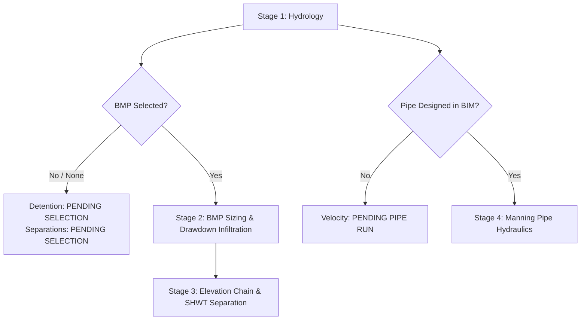

# Implementation Plan — Stormwater Engineering Workflow & Sizing Re-Architecture

This document outlines the engineering and code changes required to restructure the **RohoFlow Revit C# Plugin**'s calculations, moving it from a static equation solver to a high-end, dynamic civil engineering tool that reflects real-world design practices, and resolving the issue where the schedule builder fails to generate visible results.

---

## User Review Required

> [!IMPORTANT]
> *   **Schedule Sheet Generation & Activation Fix:**
>     *   **Root Cause 1: Invalid Datatype (`DOUBLE`):** The shared parameters schema previously defined the parameters using the C# keyword `DOUBLE`. In Revit shared parameter files, generic decimals must be defined using `NUMBER`. The invalid type causes Revit's shared parameters parser to fail silently. We will correct the datatype in the schema to `NUMBER`.
>     *   **Root Cause 2: Blocked by Existing Empty Schedules:** If a schedule named `"RohoFlow Stormwater Schedule"` already exists from a previous failed run, the builder returns early without updating it. We will re-engineer the builder to **delete the existing schedule first** to force a clean, complete rebuild of all fields and columns.
>     *   **Root Cause 3: Background Execution (No Focus):** The schedule was created in the database but never opened in the Revit UI. We will update the view model to automatically set the newly created schedule as Revit's `ActiveView`, so it instantly pops open on the user's screen.
> *   **Explicit "None" Detention Selector (Default):** The **Detention System Method** will now default to `"None"`. Calculations, drawdown checks, and bottom-of-excavation checks will remain in a neutral `"PENDING BMP SELECTION"` status until the user explicitly selects a physical BMP method.
> *   **Explicit "None" Groundwater Recharge Selector (Default):** A new **Groundwater Recharge Method** combobox will be added, defaulting to `"None"`. GSR-32 recharge deficit logic will display `"PENDING RECHARGE DESIGN"` rather than running calculations pre-maturely.
> *   **BIM-State Conveyance Pipe Velocity Checks:** Full-flow pipe velocity and Manning conveyance checks will default to `"PENDING PIPE RUN"` (neutral gray badge) upon startup. They will only compute and display a pass/fail compliance status *after* a physical pipe is generated/traced in the Revit model (using `"Pipe (2 Pts)"` or `"Pipe from Lines"`), linking hydraulics to actual BIM elements.
> *   **Null-Safe ComboBox WPF Bindings:** Resolves a major bug where startup ComboBox data-binding sets properties to `null`, triggering a `NullReferenceException` in `ExecuteCalculate()` that halts calculation updates and leaves all compliance badges at their default green "COMPLIANT / PASS / SAFE" states.
> *   **Calculation Error Safety Wrapping:** All calculation steps in the ViewModel will be enclosed in a robust `try-catch` block. If any parsing or mathematical error occurs, it will log the error and set all compliance badges to `"CALCULATION ERROR"` in red, preventing silent failure.

---

## Technical Design: The Staged Stormwater Engineering Workflow

To ensure physical logic and compliance metrics are calculated in the correct sequence, the calculation pipeline inside `StormwaterCalcViewModel.ExecuteCalculate()` will be re-engineered into four distinct, logical engineering stages:



### Stage 1: Hydrology (Runoff Volume Sizing)
- **Target:** Compute the hydrological required storage volume (`RequiredVolumeCF`) based on site areas, selected county rainfall depths (NJAC 7:8 / WQDS), and soil HSG Curve Numbers.
- **Workflow:** This is computed instantly on startup and automatically updates when areas, soil class, county, or regulatory track changes.

### Stage 2: BMP Sizing & Drawdown Infiltration
- **Input Check:** Evaluates `SelectedDetentionMethod`.
- **None Selected:**
  - Set `ProvidedVolumeCF = 0.0` and `DrainTimeHours = 0.0`.
  - Set Drawdown Compliance Badge to `"PENDING BMP SELECTION"` (Color: `#8A8A85` neutral gray, Background: `#1A8A8A85`).
- **BMP Selected:**
  - Run physical calculations based on the selected method's parameters (e.g. seepage pit counts, catalog dimensions, gravel bed thickness, void ratio).
  - Calculate `ProvidedVolumeCF` representing physical interior storage + gravel packing void storage.
  - Calculate `DrainTimeHours` (infiltration drawdown time) with the mandatory Soil Factor of Safety of 2.0 applied.
  - **Drawdown Compliance Rules (72-hr limit):**
    - If `testedPerc <= 0`: set badge to `"PERC RATE REQUIRED"` (Orange/Red `#FF4500`).
    - If `DrainTimeHours > 72.0`: set badge to `"NON-COMPLIANT (>72 HR)"` (Red `#FF4500`).
    - If `DrainTimeHours <= 72.0`: set badge to `"FULLY COMPLIANT"` (Green `#3CB371`).

### Stage 3: Elevation Chain & SHWT Separation
- **Input Check:** Evaluates `SelectedDetentionMethod`.
- **None Selected:**
  - Set `ExcavationElevation = 0.0`, `HwtSeparationFt = 0.0`, `FootingSeparationFt = 0.0`.
  - Set both HWT Separation and Footing Safety Badges to `"PENDING BMP SELECTION"` (Color: `#8A8A85` neutral gray).
- **BMP Selected:**
  - Compute invert elevations:
    - $StartInvert = GrateElev - (MinPipeCover / 12.0) - (PipeDia / 12.0)$
    - $EndInvert = StartInvert - (PipeLength \times (PipeSlope / 100.0))$
    - $ExcavationElevation = EndInvert - SystemHeight - GravelBelow$
  - Compute vertical separation clearances:
    - $HwtSeparation = ExcavationElevation - HighWaterTable$
    - $FootingSeparation = ExcavationElevation - AdjacentFooting$
  - **HWT Separation Compliance (NJAC 7:8 min 2.0 ft):**
    - If $HwtSeparation \ge 2.0$ ft: set badge to `"HWT PASS"` (Green `#3CB371`).
    - If $HwtSeparation < 2.0$ ft: set badge to `"HWT VIOLATION (<2.0')"` (Red `#FF4500`).
  - **Adjacent Footing Safety (no structural undercut):**
    - If $FootingSeparation \ge 0.0$ ft: set badge to `"FOOTING SAFE"` (Green `#3CB371`).
    - If $FootingSeparation < 0.0$ ft: set badge to `"UNDERCUT WARNING"` (Red `#FF4500`).

### Stage 4: Conveyance Piping (Manning Hydraulics)
- **Input Check:** Track a new boolean field `_isPipeDesigned` inside the ViewModel, defaulting to `false`.
- **No Pipe Designed:**
  - Set `PipeVelocityFPS = 0.0`.
  - Set Velocity Compliance Badge to `"PENDING PIPE RUN"` (Color: `#8A8A85` neutral gray).
- **Pipe Designed:**
  - When the user generates a pipe (clicks `"Pipe (2 Pts)"` or `"Pipe from Selected Lines"`), automatically extract the length and slope from the generated Revit Pipe element, populate `PipeLengthText` and `PipeSlopeText`, and set `_isPipeDesigned = true`.
  - Run Manning's full-flow hydraulics equation.
  - **Velocity Compliance Rules (Newark limits: 2.5 FPS < V < 10.0 FPS):**
    - If $2.5 \le V \le 10.0$ FPS: set badge to `"VELOCITY PASS"` (Green `#3CB371`).
    - If $V < 2.5$ FPS: set badge to `"VELOCITY LOW (<2.5)"` (Red `#FF4500`).
    - If $V > 10.0$ FPS: set badge to `"VELOCITY HIGH (>10)"` (Red `#FF4500`).

---

## Proposed Changes

We will edit the Core, Bridge, and UI/ViewModel layers of the `RohoFlow` project.

### 1. Core Mathematical Layer (`src\RohoFlow.Core`)
- No changes. Core calculations remain clean.

### 2. Revit API Database Layer (`src\RohoFlow.Bridge`)

#### [MODIFY] [SharedParameterWriter.cs](file:///C:/Users/thoma/Dropbox/My%20Documents/RevitPlugins/RohoFlow/src/RohoFlow.Bridge/SharedParameterWriter.cs)
- Rewrite `CreateAndBindSharedParameters()` to:
  - Overwrite `RohoFlowSharedParameters.txt` on every run.
  - Change the C# keyword `DOUBLE` to the valid Revit shared parameter datatype `NUMBER` across all 6 parameter lines in the generated schema:
    ```
    PARAM   ...   RT_Stormwater_RequiredVolume   NUMBER   ...
    ```

#### [MODIFY] [NativeScheduleBuilder.cs](file:///C:/Users/thoma/Dropbox/My%20Documents/RevitPlugins/RohoFlow/src/RohoFlow.Bridge/NativeScheduleBuilder.cs)
- Update `CreateOrGetStormwaterSchedule()` to:
  - Check if the schedule `"RohoFlow Stormwater Schedule"` already exists.
  - If it exists, delete the existing schedule using `_doc.Delete(existingSchedule.Id)` inside a transaction first, ensuring that clicking `"Build Schedule"` always forces a complete, clean rebuild of the schedule fields and columns.

### 3. User Interface Layer (`src\RohoFlow.Revit`)

#### [MODIFY] [StormwaterCalcView.xaml](file:///C:/Users/thoma/Dropbox/My%20Documents/RevitPlugins/RohoFlow/src/RohoFlow.Revit/UI/StormwaterCalcView.xaml)
- Add a new **Groundwater Recharge Method** selection grid row:
  - TextBlock: `"Groundwater Recharge Method:"`
  - ComboBox: bound to `SelectedRechargeMethod`, loaded from `RechargeMethods`.
- Update the parameters panel and bindings:
  - Add strict `SelectedValuePath` or simple `SelectedItem` bindings that handle `"None"` selections gracefully.
- Style badges to support neutral gray visual states for pending selections:
  - Adjust styling so that pending states read `"PENDING BMP SELECTION"` or `"PENDING PIPE RUN"` with high-contrast text.

#### [MODIFY] [StormwaterCalcViewModel.cs](file:///C:/Users/thoma/Dropbox/My%20Documents/RevitPlugins/RohoFlow/src/RohoFlow.Revit/UI/StormwaterCalcViewModel.cs)
- Add `"None"` to the top of `DetentionMethods` list.
- Add `RechargeMethods` list: `"None"`, `"Infiltration BMP (Gsr-32)"`, `"Pervious Paving Recharge"`, `"Vegetated Filter Strip"`, `"Waiver / Exempt"`.
- Expose string/combobox properties for `SelectedRechargeMethod` (defaulting to `"None"`).
- Add private boolean field `_isPipeDesigned` defaulting to `false`.
- Update commands:
  - Set `_isPipeDesigned = true` in `ExecuteGeneratePipe()` and `ExecuteGeneratePipesFromLines()` after successful pipe creation in Revit.
- Restructure `ExecuteCreateSchedule()`:
  - Capture the generated `ViewSchedule` returned by `NativeScheduleBuilder.CreateOrGetStormwaterSchedule()`.
  - Set `_uiDoc.ActiveView = schedule` so the newly generated schedule instantly pops open in Revit.
- Restructure `ExecuteCalculate()`:
  - Implement full null-safety checks:
    ```csharp
    bool isNewark = SelectedCounty != null && SelectedCounty.Equals("Newark (Local)", StringComparison.OrdinalIgnoreCase);
    bool isMinPerInch = SelectedInfiltrationUnit != null && SelectedInfiltrationUnit.Contains("min/inch");
    string detention = SelectedDetentionMethod ?? "None";
    string recharge = SelectedRechargeMethod ?? "None";
    ```
  - Enclose calculation segments in a `try-catch (Exception ex)` block that catches calculation anomalies, logs details, and falls back to:
    ```csharp
    DrainComplianceText = "CALCULATION ERROR";
    DrainComplianceColor = "#FF4500";
    DrainComplianceBg = "#1AFF4500";
    ```
  - Code the 4 distinct calculation stages as documented above.

---

## Phase 4: Advanced Sizing, Spatial Hydraulics & RFA Loader System (Upcoming Sprints)

To deliver a fully comprehensive, state-of-the-art solution, Phase 4 will be expanded based on the project manager's audited specifications and direct user feedback:

### Phase 4.1: Programmatic RFA Family Loader System
*   **Target:** Program a robust Revit Family loader that checks, extracts, and loads parametric stormwater RFA models into the active project library.
*   **Workflow:**
    *   Embed specific RFA models (Peerless Concrete Seepage Pits, NDS Flo-Wells, EZflow bundles, and StormTech chambers) as resources inside `RohoFlow.Revit.dll`.
    *   On selecting a detention system in the combobox, check if the corresponding family is already loaded in the `Document`'s `FilteredElementCollector(typeof(Family))` collection.
    *   If missing, extract the embedded RFA bytes to a temporary directory (`Path.GetTempPath()`) and call the Revit API transaction:
        ```csharp
        bool success = doc.LoadFamily(tempFilePath, out Family loadedFamily);
        ```
    *   This ensures the user does not need to pre-load any families into their Revit template—the plugin provides them on-the-fly!

### Phase 4.2: Hybrid NOAA PFDS / USDA SDA API geocoding (Option B)
*   **Target:** Implement a serverless address geocoding pipeline with a dynamic offline fallback.
*   **Workflow:**
    *   When the user enters a municipal street address, the plugin fires asynchronous HTTP requests (using `HttpClient` inside `RohoFlow.Bridge`) to geocode via the **US Census Geocoder**.
    *   Extract Latitude/Longitude and send coordinate queries to the **NRCS Soil Data Access API** (using WKT POINT intersections) to fetch the map unit symbol (`musym`), component name (`compname`), and Hydrologic Soil Group (`hydgrp`) in real-time.
    *   Simultaneously fetch NOAA Atlas 14 Precipitation Frequency Data Server (PFDS) storm depths via the local `pfds-lookup-proxy.php` service.
    *   **Offline Fallback:** If internet access is blocked or geocoders are unreachable, gracefully fall back to the embedded county-level database (`RainfallData.cs`) and allow the user to input tested rates manually.

### Phase 4.3: Newark URA Recharge Exemption Auto-Detection
*   **Target:** Programmatically recognize PA1 / Urban Redevelopment Area boundaries.
*   **Workflow:**
    *   In the ViewModel, if `SelectedCounty` is set to `"Newark (Local)"` or the hybrid geocoding address resolves to Newark, automatically flag the project as URA Exempt.
    *   Display a prominent amber info banner: `"Newark PA1 Urban Redevelopment Area — Recharge Exempt under NJAC 7:8-5.4(b)2"`.
    *   Default the Groundwater Recharge Method to `"Waiver / Exempt"`, setting `RechargeDeficitCF = 0.0` but allowing the user to override it for voluntary LEED compliance.

### Phase 4.4: Full Major Development Sizing Pipeline (NRCS & TR-55 Ch. 6)
*   **Target:** Completely handle both Minor and Major developments in C#.
*   **Workflow:**
    *   **6-Storm Compliance Engine:** Compile `TABLE_5_5` (current precipitation factors) and `TABLE_5_6` (future precipitation projected factors) for all 21 counties inside `RainfallData.cs`.
    *   Implement the **SCS TR-55 Graphical Peak Discharge** unit peak flow lookup using Type III distribution coefficients:
        $$\log_{10}(q_u) = C_0 + C_1 \cdot \log_{10}(T_c) + C_2 \cdot \log_{10}(T_c)^2$$
        interpolated by $I_a / P$ ratios.
    *   Implement **TR-55 Chapter 6 Detention Sizing**: Estimate required storage volume using the third-order polynomial:
        $$V_s / V_r = 0.682 - 1.43x + 1.64x^2 - 0.804x^3$$
        and output governing storm sizing parameters on the WPF dashboard.
    *   Provide recommendation panels (HDPE pipe rows/lengths, seepage pit counts, or open basin depths) that meet the governing storm storage requirement.

---

## Verification Plan

### Automated Tests
- Build `Revit2027` configuration using `dotnet build` to ensure complete syntax validity and lack of compilation errors.

### Manual Verification
- **Schedule Rebuild & Pop-up Check:** Click the `"Build Schedule"` button. Verify that:
  1. The schema is parsed cleanly (proving `NUMBER` datatype is correct).
  2. The schedule sheet is automatically created, the 6 stormwater columns are populated with numerical data, and **the view instantly opens in Revit**.
  3. Clicking `"Build Schedule"` a second time deletes the old view and generates a fresh one without throwing errors.
- **Startup State Check:** Launch the plugin and confirm that the drawdown, HWT separation, adjacent footing safety, and pipe velocity badges all display in **neutral gray** as `"PENDING BMP SELECTION"` or `"PENDING PIPE RUN"`. Confirm that no calculations run pre-maturely.
- **Detention Selection Check:** Choose `"Precast Seepage Pit (Dry Well)"`. Confirm that drawdown, HWT, and footing calculations immediately fire.
- **High Drawdown Violation Check:** Input a very low Tested Soil Perc Rate (e.g. `0.05` in/hr). Verify that the drawdown calculations result in a high drawdown time (e.g. `600+` hours) and that the badge instantly shifts to red showing `"NON-COMPLIANT (>72 HR)"`.
- **Elevation Violation Check:** Increase the SHWT height (e.g. `98.00` ft). Verify that the HWT Separation badge shifts to red showing `"HWT VIOLATION (<2.0')"` in real-time.
- **Pipe Hydraulics State Check:** Verify the pipe velocity badge displays `"PENDING PIPE RUN"` initially. Run `"Pipe from Lines"` on sketched detail lines. Verify that the Revit pipe is created, `_isPipeDesigned` turns `true`, actual dimensions are extracted, and the badge shifts to green `"VELOCITY PASS"` (or red violations if slope is out of bounds).
