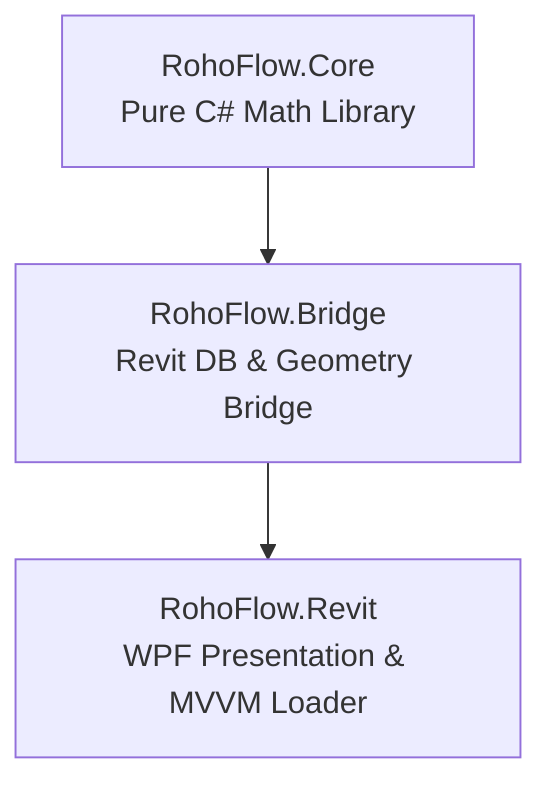

# RohoFlow — Revit Stormwater Plugin PM Build Playbook

This document serves as the official **Project Management Build Playbook & Engineering Checklist** for the **RohoFlow Revit Stormwater Plugin** (.NET 8/10, Revit 2025–2027 Suite). Written from the perspective of a seasoned civil engineering software Project Manager, this playbook outlines the exact milestones, mathematical verification gates, and database connection checkpoints required to deliver a compliant and stable BIM tool.

---

## 1. Project Overview & Architectural Alignment

To ensure that the Revit plugin operates with maximum stability and does not crash the host Revit process during database transactions, the software is built using a strict **Three-Project decoupled architecture**:



- **RohoFlow.Core:** A pure, zero-dependency C# library that contains only the raw hydrological and hydraulic equations. Because it has no references to Autodesk DLLs, it can be unit-tested in isolation instantly.
- **RohoFlow.Bridge:** Handles the interaction with the active Revit database. It runs transactions, reads model geometries (Toposolids/Floors), programmatically injects shared parameters, writes parameter values, and generates native Pipes and Schedules.
- **RohoFlow.Revit:** The presentation layer. It loads the **RohoSuite** Ribbon tab, houses the premium WPF XAML view, and binds user inputs to the core math engine via MVVM view models.

---

## 2. The Agile Sprints Breakdown & Checklist

### Sprint 1: Pure C# Core Mathematical Sizing Engines (RohoFlow.Core)
*Focus: Implementing raw civil engineering calculations with zero Autodesk dependencies.*

- [x] **Step 1.1: Decoupled Project Structure**
  - Establish `RohoFlow.sln` with target multi-version configurations for Revit 2025, 2026, and 2027 based on conditional directives.
- [x] **Step 1.2: Rational Runoff Volume Engine (`RationalRunoffEngine.cs`)**
  - Implement NJDEP-compliant weighted average volume equations.
  - *Math Check:* Sum individual pervious and impervious runoff depths separately before converting to total volume delta ($V_{req} = V_{proposed} - V_{existing}$) to prevent under-sizing.
- [x] **Step 1.3: Soil Infiltration & Drawdown Engine (`InfiltrationDrawdownEngine.cs`)**
  - Apply the mandatory **Factor of Safety of 2.0** to the soil test rate (halving tested rate, doubling tested MPI).
  - Calculate lateral surface wall seeping areas for precast seepage pits.
  - *Validation Gate:* If $T_{drain} > 72.0$ hours, flag as a regulatory vector-breeding violation.
- [x] **Step 1.4: Gravity Pipe Manning Conveyance Engine (`ManningPipeEngine.cs`)**
  - Program full-flow capacity and velocity equations using Manning's roughness coefficient ($n = 0.013$ for PVC).
  - *Validation Gate:* Limit velocities strictly between **2.5 FPS** (self-cleaning scour minimum) and **10.0 FPS** (erosion maximum) under Newark §41:17 regulations.
- [x] **Step 1.5: GSR-32 Annual Groundwater Recharge Engine (`Gsr32RechargeEngine.cs`)**
  - Code the 208-soil database climate factor multipliers and regression constants.
  - Calculate required recharge volumes based on proposed building and pavement footprints.

---

### Sprint 2: Revit API Database & Geometry Bridge Layer (RohoFlow.Bridge)
*Focus: Extracting physical BIM elements, running transactional writebacks, and creating native elements.*

- [x] **Step 2.1: Model Data Collector (`SiteDataExtractor.cs`)**
  - Collect geometry data supporting both modern `Toposolid` meshes (Revit 2026/2027) and legacy `TopographySurface` objects (Revit 2025).
  - Collect Floors representing buildings and pavements.
- [x] **Step 2.2: Sidewalk & Right-of-Way Comments Segregator**
  - Filter pavements by looking at the `Comments` parameter. If marked "offsite", "off-site", or "right-of-way", exclude their areas from the site hydrology required detention volume (Newark §41:17 boundary rule).
- [x] **Step 2.3: Coordinate Converter (`CoordinateConverter.cs`)**
  - Program Transverse Mercator projections to convert decimal Latitude and Longitude to **NAD83 New Jersey State Plane Coordinate System (US Survey Feet)**.
  - Enables serverless soil geocoding against the NRCS Soil Data Access API.
- [x] **Step 2.4: Physical Model Pipe Builder (`PipeModelBuilder.cs`)**
  - Programmatically generate native, physical Plumbing `Pipe` elements in the drawing database based on calculated pipe diameters and slopes.
- [x] **Step 2.5: Shared Parameter Transaction Writer (`SharedParameterWriter.cs`)**
  - Programmatically generate and bind custom parameters (`RT_Stormwater_`) to the host element.
  - *Critical Fix:* Define datatypes using the valid Revit shared parameter datatype `NUMBER` instead of the C# `DOUBLE` to prevent Revit database parsing errors.

---

### Sprint 3: WPF Presentation, MVVM, and Delivery Layer (RohoFlow.Revit)
*Focus: Creating a premium, dark-mode user interface and robust drawing schedule generators.*

- [x] **Step 3.1: Premium WPF Interface (`StormwaterCalcView.xaml`)**
  - Design a high-contrast dark-mode interface (`Background="#0F0F0D"`, `Foreground="#F6F5F0"`, `AccentColor="#C5D93D"`).
  - Organize parameters into a single resizable ScrollViewer.
- [x] **Step 3.2: Soil Percolation UX Grouping**
  - Group **Tested Soil Perc Rate** and **Tested Perc Unit** inputs next to "Soil HSG Class" at the top of the interface. This clusters soil properties logically and eliminates the confusion of having the rate input buried far down.
- [x] **Step 3.3: Context-Sensitive Visibility Input Panels**
  - Add individual input panels for each of the 6 major detention types (Seepage Pits, HDPE, SDR-35, Flo-Wells, EZflow, StormChambers, StormTech).
  - Bind panels directly to C# Visibility properties (`PrecastVisibility`, `HdpeVisibility`, etc.) to prevent WPF BAML crashes.
- [x] **Step 3.4: Four-Stage Civil Engineering State Engine**
  - Restructure calculations into 4 logical stages:
    - **Stage 1 (Hydrology):** Real-time required storage delta.
    - **Stage 2 (BMP Sizing & Infiltration Drawdown):** Applies Soil FOS = 2.0; closed systems bypass soil infiltration and label drawdown as `"N/A (ORIFICE OUTFLOW)"` in green.
    - **Stage 3 (Elevation Chain & Vertical Clearance):** Generates invert chain and flags High Water Table ($<2.0'$ ft NJAC 7:8) or footing structural undercut ($<0.0'$ ft) warnings.
    - **Stage 4 (Gravity Conveyance):** Runs Manning flow hydraulics only after a physical pipe is designed in BIM.
- [x] **Step 3.5: Crash-Proof Native Revit Schedule Generator (`NativeScheduleBuilder.cs`)**
  - Programmatically delete any pre-existing `"RohoFlow Stormwater Schedule"` to force a clean, complete rebuild of all fields and columns.
  - Wrap the `def.AddField(field)` loop in a `try-catch` block. If Revit throws an error when trying to add a standard field (like `Family` or `Type`) which is unsupported by the category (like Project Information), it is gracefully skipped.
  - Automatically call `ExecuteSaveToParameters()` at the beginning of schedule generation so that calculations are saved to the Revit parameters first, preventing blank schedule columns.

---

## 3. User-Approved Product Steering & Decisions

Through direct stakeholder feedback, we have locked in key engineering and software architectural decisions for subsequent releases:

1. **Geographical Jurisdiction:**
   - Focus is **New Jersey only** for now, enforcing strict compliance with NJAC 7:8, municipal ordinances (Newark §41:17), and NAD83 State Plane FIPS 2900 coordinate projections.
2. **Soil & Rainfall Database Storage:**
   - Keep the entire database **embedded** locally in C# libraries for now (embedded JSON or hardcoded dictionary collections) rather than running centralized SQL web servers, guaranteeing offline stability and zero network lag.
3. **Model Homepoint Survey Alignment:**
   - Build a geocoding relocation routine. The typed project address will determine the WGS84 coordinates, calculate the exact NAD83 NJ State Plane Easting and Northing, and programmatically reposition the Revit Project Base Point or Survey Point.
4. **Physical Placement & Clearance Constraints:**
   - Stormwater detention placement must respect a **strict 10-foot building foundation buffer** to prevent hydrostatic water damage to structures.
5. **Topography Sheet & Slope Analysis:**
   - Incorporate slope travel-time calculations by programmatically extracting face normals from Revit topography meshes.

---

## 4. Phase 4 Technical Specifications (Advanced Sprints)

This section provides the technical blueprints for programmers to implement the user's advanced spatial and hydraulic requirements in Phase 4.

### 4.1 Address Geocoding & Revit Model Homepoint Relocation
To align the Revit workspace with real-world survey space, the plugin will geocode project addresses and relocate Revit's homepoints programmatically:
1. **Geocoding:** Call the OpenStreetMap Nominatim or Google Geocoding API to fetch decimal WGS84 Latitude and Longitude for the project address.
2. **State Plane Translation:** Convert Lat/Lon to NJ State Plane survey feet via `CoordinateConverter.LatLonToNJStatePlane()`.
3. **Revit Relocation:** Query Revit's `BasePoint` elements representing the Project Base Point and Survey Point:
   ```csharp
   var basePoints = new FilteredElementCollector(doc)
       .OfClass(typeof(BasePoint))
       .Cast<BasePoint>();

   BasePoint projectBasePoint = basePoints.FirstOrDefault(bp => !bp.IsShared);
   BasePoint surveyPoint = basePoints.FirstOrDefault(bp => bp.IsShared);

   using (Transaction t = new Transaction(doc, "Align Model Survey Homepoint"))
   {
       t.Start();
       
       // Programmatically write NAD83 Easting (X) and Northing (Y) survey feet
       surveyPoint.get_Parameter(BuiltInParameter.BASEPOINT_EASTWEST_PARAM).Set(eastingFeet);
       surveyPoint.get_Parameter(BuiltInParameter.BASEPOINT_NORTHSOUTH_PARAM).Set(northingFeet);
       
       t.Commit();
   }
   ```
4. **USDA SDA Soil Integration:** Once survey points are geocoded, any clicked point in the Revit project viewport can be transformed into NJ State Plane coordinates instantly, enabling the plugin to query the USDA Soil Data Access (SDA) web service to fetch the exact soil mapping unit and tested percolation rate.

### 4.2 The 10-Foot Foundation Buffer & Yard Placement Engine
To automate physical stormwater BMP modeling while protecting structural foundations:
1. **Foundation Buffers:** Collect all `OST_Walls` and `OST_StructuralFoundations` in the active project. Formulate 2D bounding boxes (CurveLoops) around these footprint shapes and apply a **10.0-foot offset buffer** outwards.
2. **Allowable Yard Zones:** Let the designer sketch a Filled Region (category `OST_DetailCurves` or a specific Area) labeled "Stormwater Yard Limit". Extract its boundary polygon.
3. **Intersection & Exclusion Math:** Perform polygon clipping:
   $$\text{Allowable Placement Zone} = \text{Stormwater Yard Limit} \setminus \text{10-foot Building Buffers}$$
4. **BMP Placement:** Ensure the generated seepage pit or chamber vault centroid resides entirely within the Allowable Placement Zone. If it falls within the 10-foot building buffer, throw a warning badge: `FOUNDATION BUFFER VIOLATION` in orange/red.

### 4.3 Topography Sheet & Slope Analysis
To calculate travel times ($T_c$) using Revit's native topography:
1. **Mesh Extraction:** Extract the triangular mesh representation of the active `Toposolid` (Revit 2026+) or `TopographySurface` (Revit 2025) using `GeometryElement` iteration.
2. **Face Normal Slope Calculation:** For each triangular face of the mesh, retrieve the normal vector $\vec{n} = (n_x, n_y, n_z)$. Calculate the face's slope angle $\theta$ and slope percentage $S$:
   $$\theta = \arccos(n_z) \quad (\text{radians})$$
   $$S = \tan(\theta) \times 100 \quad (\%)$$
3. **Flow Direction Vector:** The steepest flow direction vector $\vec{v}_{\text{flow}}$ down the triangular face is the projection of the gravity vector $(0,0,-1)$ onto the face's plane:
   $$\vec{v}_{\text{flow}} = (0,0,-1) - (\vec{n} \cdot (0,0,-1))\vec{n} = (n_x n_z, \, n_y n_z, \, n_z^2 - 1)$$
4. **Sheet Travel Time ($T_c$):** Trace the steepest descent flow path across adjacent triangular mesh faces to calculate total travel length and slope inputs, feeding them into the NRCS sheet flow equations.
