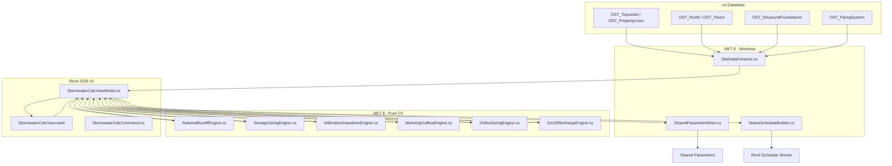

# Stormwater Calculator — Revit 2026 C# Transition Blueprint

This document provides a highly structured, production-level engineering blueprint and code roadmap for porting the audited **Stormwater Calculator** from its web-based PHP/JS implementation into the **RohoTools .NET 8 / Revit 2026** C# desktop suite. 

It aligns exactly with the **Three-Project Architecture** specified in the [RohoTools Project Reference](file:///y:/greenstories/TomOnly/RohoTools-complete-reference.md).

---

## 1. Architectural Architecture & Data Flow

When moving from the website to Revit, manual inputs are replaced with native model extraction, and the output is written directly to shared parameters and schedules inside the `.rvt` project database.



---

## 2. Shared Parameter Bindings (`RohoTools.txt`)

To ensure native scheduling and tagging capabilities without requiring custom views, the calculation results must be written to **Shared Parameters** bound to the site’s `OST_Toposolid` (or a custom `OST_ProjectInformation` group).

The following shared parameter schema is registered under the `Site - Stormwater` group:

```text
# GROUP: Site - Stormwater
PARAM	GUID-0001...	RT_Stormwater_RequiredVolume	DOUBLE	UT_Volume	LABEL: Required Detention Volume (CF)
PARAM	GUID-0002...	RT_Stormwater_StorageProvided	DOUBLE	UT_Volume	LABEL: Storage Volume Provided (CF)
PARAM	GUID-0003...	RT_Stormwater_DrainTime        	DOUBLE	UT_Number	LABEL: Infiltration Drain-Down Time (hrs)
PARAM	GUID-0004...	RT_Stormwater_OutflowDiameter	DOUBLE	UT_PipeSize	LABEL: Outflow Pipe Diameter Required (in)
PARAM	GUID-0005...	RT_Stormwater_OrificeDiameter	DOUBLE	UT_PipeSize	LABEL: Orifice Control Diameter (in)
PARAM	GUID-0006...	RT_Stormwater_HwtSeparation    	DOUBLE	UT_Length	LABEL: Excavation to HWT Separation (ft)
PARAM	GUID-0007...	RT_Stormwater_ExcavationDepth  	DOUBLE	UT_Length	LABEL: Bottom of Excavation Elevation (ft)
PARAM	GUID-0008...	RT_Stormwater_AnnualRechargeDeficit	DOUBLE	UT_Volume	LABEL: Annual Recharge Deficit (CF/yr)
```

---

## 3. Project 1: `RohoTools.Core` (Pure C# Engines)

This library contains the raw mathematical and physics-based models. It has **zero dependencies on Revit API DLLs**, allowing it to be 100% unit-testable via xUnit.

### 3.1 Rational Runoff & Storage Sizing
Ported directly from our audited calculations, using the volume-averaging method.

```csharp
namespace RohoTools.Core.Site
{
    public class RationalRunoffEngine
    {
        public const double SFA = 43560.0; // Square feet per acre

        public struct RunoffOutput
        {
            public double ExistingPeakCFS { get; set; }
            public double ProposedPeakCFS { get; set; }
            public double ExistingVolumeCF { get; set; }
            public double ProposedVolumeCF { get; set; }
            public double RequiredStorageCF { get; set; }
        }

        public static RunoffOutput CalculateRunoff(
            double lotSF,
            double bldExSF, double bldPrSF,
            double pavedExSF, double pavedPrSF,
            double seededExSF, double seededPrSF,
            double intensityIPH,
            double durationMin,
            double safetyFactorPct = 30.0,
            bool isInfiltration = true)
        {
            const double cB = 0.99; // Building C
            const double cP = 0.95; // Paved C
            const double cS = 0.20; // Seeded C

            // Weighted C components (Area in Acres)
            double wcBEx = cB * (bldExSF / SFA);
            double wcPEx = cP * (pavedExSF / SFA);
            double wcSEx = cS * (seededExSF / SFA);

            double wcBPr = cB * (bldPrSF / SFA);
            double wcPPr = cP * (pavedPrSF / SFA);
            double wcSPr = cS * (seededPrSF / SFA);

            double qE = (wcBEx + wcPEx + wcSEx) * intensityIPH;
            double qP = (wcBPr + wcPPr + wcSPr) * intensityIPH;

            // Infiltration uses full storm duration (TP), detention uses TP/2
            double tpF = isInfiltration ? durationMin : durationMin * 0.5;

            double vE = qE * tpF * 60.0;
            double vP = qP * tpF * 60.0;
            double diff = vP - vE;
            double required = diff * (1.0 + (safetyFactorPct / 100.0));

            return new RunoffOutput
            {
                ExistingPeakCFS = qE,
                ProposedPeakCFS = qP,
                ExistingVolumeCF = vE,
                ProposedVolumeCF = vP,
                RequiredStorageCF = Math.Max(0, required)
            };
        }
    }
}
```

### 3.2 72-Hour Infiltration Drawdown Engine
Encodes the mandatory tested infiltration Factor of Safety of 2.0.

```csharp
namespace RohoTools.Core.Site
{
    public class InfiltrationDrawdownEngine
    {
        public struct DrawdownOutput
        {
            public double DesignPercIPH { get; set; }
            public double DesignPercMPI { get; set; }
            public double LateralSurfaceAreaSF { get; set; }
            public double InfiltrationRateCFM { get; set; }
            public double DrainTimeHours { get; set; }
            public bool IsCompliant { get; set; }
        }

        public static DrawdownOutput CalculateSeepageDrawdown(
            double totalVolumeCF,
            double pitOD,
            double pitHeight,
            int numberOfPits,
            double testedPercRate,
            bool isMinPerInch)
        {
            // Convert to base units
            double testedMPI = isMinPerInch ? testedPercRate : (testedPercRate > 0 ? 60.0 / testedPercRate : 0);
            double testedIPH = isMinPerInch ? (testedPercRate > 0 ? 60.0 / testedPercRate : 0) : testedPercRate;

            // Apply Factor of Safety of 2.0 (Design IPH is halved, Design MPI is doubled)
            double designIPH = testedIPH / 2.0;
            double designMPI = testedMPI * 2.0;

            // Cylinder side wall infiltration area (weep holes)
            double sArea = Math.PI * pitOD * pitHeight * numberOfPits;

            // Infiltration rate Q = A / (12 * t_mpi)
            double qInfil = designMPI > 0 ? sArea / (12.0 * designMPI) : 0.0;

            // Drain hours = Vol / Q_infil / 60
            double drainHrs = qInfil > 0 ? totalVolumeCF / qInfil / 60.0 : 999.0;

            return new DrawdownOutput
            {
                DesignPercIPH = designIPH,
                DesignPercMPI = designMPI,
                LateralSurfaceAreaSF = sArea,
                InfiltrationRateCFM = qInfil,
                DrainTimeHours = drainHrs,
                IsCompliant = drainHrs <= 72.0
            };
        }
    }
}
```

---

## 4. Project 2: `RohoTools.Bridge` (Revit Extractor)

The bridge project references both the Revit API and the Core engines. It handles model queries, spatial coordinate conversions, and parameter writing.

### 4.1 Automated Elevation & Area Extractor
Reads geometries from the Revit model database using `FilteredElementCollector`.

```csharp
using Autodesk.Revit.DB;
using Autodesk.Revit.DB.Architecture;
using System.Collections.Generic;
using System.Linq;

namespace RohoTools.Bridge.Site
{
    public class SiteDataExtractor
    {
        private readonly Document _doc;

        public SiteDataExtractor(Document doc)
        {
            _doc = doc;
        }

        public struct ExtractedSiteData
        {
            public double TotalLotAreaSF { get; set; }
            public double ProposedBuildingAreaSF { get; set; }
            public double LowestAdjacentGrade { get; set; }
            public double MinFootingElevation { get; set; }
        }

        public ExtractedSiteData ExtractProjectData()
        {
            double lotArea = 0;
            double bldArea = 0;
            double lowestGrade = 9999.0;
            double minFooting = 9999.0;

            // 1. Property Lines Area (Lot Area)
            var propLines = new FilteredElementCollector(_doc)
                .OfCategory(BuiltInCategory.OST_PropertyLines)
                .WhereElementIsNotElementType()
                .Cast<PropertyLine>();

            foreach (var pl in propLines)
            {
                // PropertyLine area is in SF internally
                lotArea += pl.get_Parameter(BuiltInParameter.PROPERTY_LINE_AREA).AsDouble();
            }

            // 2. Proposed Building Footprint (OST_Roofs Projected Area)
            var roofs = new FilteredElementCollector(_doc)
                .OfCategory(BuiltInCategory.OST_Roofs)
                .WhereElementIsNotElementType();

            foreach (var r in roofs)
            {
                var geom = r.get_Geometry(new Options());
                if (geom == null) continue;
                // Accumulate horizontal projected area
                bldArea += r.get_Parameter(BuiltInParameter.COUCH_ROOF_DIRTY_AREA_PARAM)?.AsDouble() ?? 0;
            }

            // 3. Toposolid Grade Analysis
            var toposolids = new FilteredElementCollector(_doc)
                .OfCategory(BuiltInCategory.OST_Toposolid)
                .WhereElementIsNotElementType();

            foreach (Element ts in toposolids)
            {
                if (ts is Toposolid solid)
                {
                    // Access shape points to locate lowest grade boundary
                    var edit = solid.GetSlabShapeEditor();
                    if (edit != null)
                    {
                        foreach (SlabShapeVertex vertex in edit.SlabShapeVertices)
                        {
                            if (vertex.Position.Z < lowestGrade)
                            {
                                lowestGrade = vertex.Position.Z;
                            }
                        }
                    }
                }
            }

            // 4. Structural Footings minimum depth
            var footings = new FilteredElementCollector(_doc)
                .OfCategory(BuiltInCategory.OST_StructuralFoundations)
                .WhereElementIsNotElementType();

            foreach (var f in footings)
            {
                var bbox = f.get_BoundingBox(null);
                if (bbox != null && bbox.Min.Z < minFooting)
                {
                    minFooting = bbox.Min.Z;
                }
            }

            return new ExtractedSiteData
            {
                TotalLotAreaSF = lotArea,
                ProposedBuildingAreaSF = bldArea,
                LowestAdjacentGrade = lowestGrade == 9999.0 ? 0.0 : lowestGrade,
                MinFootingElevation = minFooting == 9999.0 ? 0.0 : minFooting
            };
        }
    }
}
```

### 4.2 Soil Coordinate Conversion (USGS Lat/Lon → NJ State Plane)
Our client-side geocoding state plane math is ported here to run natively in C#.

```csharp
using System;

namespace RohoTools.Bridge.Site
{
    public class CoordinateConverter
    {
        public struct StatePlaneCoords
        {
            public double Easting { get; set; }
            public double Northing { get; set; }
        }

        /// <summary>
        /// Converts WGS84 Lat/Lon coordinates into NAD83 New Jersey State Plane Coordinate System (US Survey Feet)
        /// </summary>
        public static StatePlaneCoords LatLonToNJStatePlane(double lat, double lon)
        {
            const double deg2rad = Math.PI / 180.0;
            const double a = 6378137.0;             // GRS80 semi-major axis (meters)
            const double f = 1.0 / 298.257222101;   // GRS80 flattening
            const double k0 = 0.9999;               // scale factor
            const double lat0 = 38.833333333 * deg2rad; // lat of origin
            const double lon0 = -74.5 * deg2rad;        // central meridian
            const double FE = 150000.0 * 0.3048006096;  // false easting in meters

            double e2 = 2.0 * f - f * f;
            double phi = lat * deg2rad;
            double lam = lon * deg2rad;
            double dlam = lam - lon0;

            double N = a / Math.sqrt(1.0 - e2 * Math.sin(phi) * Math.sin(phi));
            double T = Math.tan(phi) * Math.tan(phi);
            double C = e2 / (1.0 - e2) * Math.cos(phi) * Math.cos(phi);
            double A = Math.cos(phi) * dlam;

            double M0 = a * ((1.0 - e2/4.0 - 3.0*e2*e2/64.0)*lat0 - (3.0*e2/8.0 + 3.0*e2*e2/32.0)*Math.sin(2.0*lat0) + (15.0*e2*e2/256.0)*Math.sin(4.0*lat0));
            double M = a * ((1.0 - e2/4.0 - 3.0*e2*e2/64.0)*phi - (3.0*e2/8.0 + 3.0*e2*e2/32.0)*Math.sin(2.0*phi) + (15.0*e2*e2/256.0)*Math.sin(4.0*phi));

            double xM = k0 * N * (A + (1.0 - T + C) * Math.pow(A, 3) / 6.0 + (5.0 - 18.0 * T + T * T) * Math.pow(A, 5) / 120.0);
            double yM = k0 * (M - M0 + N * Math.tan(phi) * (A * A / 2.0 + (5.0 - T + 9.0 * C + 4.0 * C * C) * Math.pow(A, 4) / 24.0));

            // Convert meters back to US Survey Feet (1 US Survey Foot = 1200/3937 meters)
            const double mToFt = 3937.0 / 1200.0;

            return new StatePlaneCoords
            {
                Easting = xM * mToFt + 150000.0,
                Northing = yM * mToFt
            };
        }
    }
}
```

---

## 5. Project 3: `RohoTools.Revit` (Ribbon & WPF UI)

This represents the client-facing presentation layer. The UI is built using **WPF (MVVM pattern)** inside the Revit desktop runtime.

### 5.1 WPF View Model (MVVM Pattern)
Uses `CommunityToolkit.Mvvm` for clean, testable properties.

```csharp
using CommunityToolkit.Mvvm.ComponentModel;
using CommunityToolkit.Mvvm.Input;
using RohoTools.Core.Site;
using RohoTools.Bridge.Site;

namespace RohoTools.Revit.UI.Site
{
    public partial class StormwaterCalcViewModel : ObservableObject
    {
        // Extracted Inputs
        [ObservableProperty] private double _lotSF;
        [ObservableProperty] private double _buildingProposedSF;
        [ObservableProperty] private double _lowestAdjacentGrade;
        [ObservableProperty] private double _minFootingElevation;

        // User Inputs
        [ObservableProperty] private double _intensityIPH = 5.9; // Default Minor Essex County
        [ObservableProperty] private double _testedPercRate = 3.0;
        [ObservableProperty] private bool _isMinPerInch = true;
        [ObservableProperty] private double _safetyFactorPct = 30.0;

        // Results
        [ObservableProperty] private double _requiredVolumeCF;
        [ObservableProperty] private double _providedVolumeCF;
        [ObservableProperty] private double _drainTimeHours;
        [ObservableProperty] private bool _isDrainCompliant;

        [RelayCommand]
        private void RunCalculations()
        {
            // 1. Run Core Runoff Sizing
            var runoff = RationalRunoffEngine.CalculateRunoff(
                LotSF,
                0, BuildingProposedSF,
                0, 0, // paved
                0, 0, // seeded
                IntensityIPH,
                15.0, // 15-min TP
                SafetyFactorPct,
                true);

            RequiredVolumeCF = runoff.RequiredStorageCF;

            // 2. Run Core Drawdown Sizing (Example 9' pit model)
            var drawdown = InfiltrationDrawdownEngine.CalculateSeepageDrawdown(
                RequiredVolumeCF,
                6.5, // 9' pit OD
                9.0, // 9' pit Height
                1,   // 1 Pit
                TestedPercRate,
                IsMinPerInch);

            DrainTimeHours = drawdown.DrainTimeHours;
            IsDrainCompliant = drawdown.IsCompliant;
        }
    }
}
```

---

## 6. Development Checklist & Port Milestones

To bring this tool to market quickly, development should be phased according to the following milestones:

- **[ ] Milestone 1: Core Porting & Unit Testing**
  * Port `RationalRunoffEngine`, `InfiltrationDrawdownEngine`, `ManningPipeCalc`, and `OrificeSizing` into `RohoTools.Core`.
  * Write xUnit unit tests verifying edge cases (e.g. 0 tested perc rate, extremely large areas).
- **[ ] Milestone 2: Bridge Model Queries**
  * Build the `SiteDataExtractor` class.
  * Test model extraction on a mock multi-family site plans (calculating toposolid bounds and roof areas).
- **[ ] Milestone 3: MVVM UI & Writeback**
  * Design the WPF `StormwaterCalcView` modal overlay.
  * Wire the WPF components to the shared parameters writing classes.
  * Implement the color-coded compliance badges in the Revit UI panel.
- **[ ] Milestone 4: Native Schedule Sheets Generation**
  * Auto-populate Revit's native schedule keys to construct a printable **Stormwater Sizing Schedule Sheet** directly on sheet coordinates.
