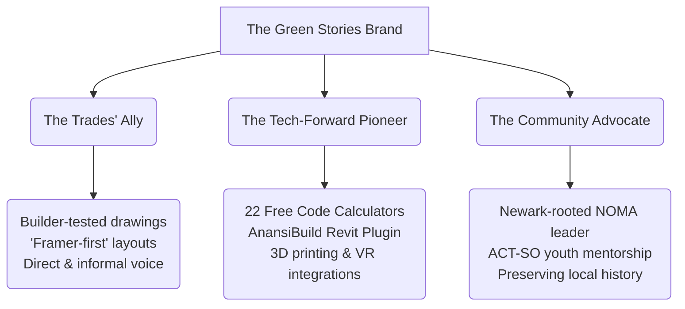

# Green Stories LLC — Design & Architectural Website Analysis

> **Date:** May 29, 2026  
> **Reviewer:** Antigravity (Advanced Agentic Coding Assistant)  
> **Target Base:** [y:\greenstories](file:///y:/greenstories)  
> **Brand Persona:** Tech-forward. Builder-tested. Community-rooted.

---

## 1. What is Already Working Beautifully (The Foundation)

Before looking at what’s missing, it is critical to acknowledge that the current website is **exceptionally well-engineered** and holds a distinctive position in the architecture market. Reviewing your files — particularly [index.php](file:///y:/greenstories/index.php), [about.php](file:///y:/greenstories/about.php), [tools.php](file:///y:/greenstories/tools.php), and [work.php](file:///y:/greenstories/work.php) — reveals a standard of craft far exceeding typical small-firm sites:

*   **Elite Typography Integration:** Pairing the elegant, high-contrast serif display fonts (`Fraunces` and `Bodoni Moda`) with the clean modernism of `Plus Jakarta Sans` and the precise technical feel of `JetBrains Mono` for numbers immediately signals a blend of heritage, design sensitivity, and structural precision.
*   **Harmonious HSL Palette:** The dark-mode canvas (`#0F0F0D`) accented by your curated greens (`--gs-accent: #C5D93D` lime-yellow and `--gs-primary: #3CB371` sea green) establishes a premium, state-of-the-art atmosphere. It breaks the generic "white-box" minimalist mold that makes most architecture sites feel corporate and cold.
*   **Superb Engineering (No-Framework PHP Stack):** The trilingual system (EN/ES/PT) is brilliantly integrated, scanning and serving page-specific translations via standard JavaScript hooks. The dynamic scanning of the `/work/` subfolders and `/images/hero/` directories means content management is light, scalable, and requires zero database overhead on IONOS shared hosting.
*   **Robust Qualifying & Security Gates:** The 18-step backend verification pipeline in [contact-handler.php](file:///y:/greenstories/contact-handler.php) (combining canvas fingerprinting, timing analysis, rate limiting, and strict budget/property gates) is a masterclass in frontend security. It weeds out unqualified leads while shielding your email from spam.

---

## 2. The "Missing Pieces" to Take It Over the Top

While the current site is highly professional, taking it "over the top" means transforming it from a **highly functional portfolio** into an **immersive narrative and experiential platform** (similar to how KPF uses structural philosophy, or how Gensler acts as a media platform). 

Here is the technical and design blueprint of what is missing to achieve that premium tier:

### A. The Hidden Diamond: The Edward T. Bowser Jr. Tribute
> [!NOTE]
> *Stories* is the word that defines your brand. Yet, the single most powerful architectural story in Newark's modern history is currently buried in your private folders ([BowserLecture_Cleaned.md](file:///y:/greenstories/TomOnly/BowserLecture_Cleaned.md)) and completely absent from the public site.

*   **What is missing:** Edward T. Bowser Jr. was the first Black licensed architect in New Jersey to pass the national board with the top grade in the country. He studied under **Le Corbusier** in Paris, worked on the *Unité d'Habitation* in Marseille, designed the futuristic Merriconda houses, built solar-powered schools in Ghana, and created wood-based American Modernist masterpieces in Essex County. 
*   **The Proposal:** Create a stunning, editorial-style **interactive tribute page** or showcase on the website. This page would integrate the rich archives you possess — letters from Le Corbusier, studio caricature drawings, structural diagrams of the 9-square-grid house, and photos of his work.
*   **Why it takes you over the top:** It establishes Green Stories not just as a firm that draws blueprints, but as a **custodian of Black architectural history and community heritage**. It gives your brand unparalleled intellectual depth and instantly commands respect from institutional clients, developers, and design boards.

### B. Interactive Process Infographics (The Permitting Journey)
*   **What is missing:** Developers, community groups, and business owners are often terrified of the zoning and permitting process (especially in Newark, with its strict parking ordinances and complex NJ UCC requirements). Currently, your "What We Do" section is a simple text grid.
*   **The Proposal:** Replace or enhance the [about.php](file:///y:/greenstories/about.php) and service sections with a **beautiful, interactive SVG or canvas process path** mapping the "Green Stories Feasibility & Permitting Pipeline."
    *   As a user hovers over a step (e.g., *Zoning & FAR Review* -> *Code Analysis* -> *Trade-Specific Construction CDs* -> *Permitting Gate*), the page dynamically highlights the exact code bodies checked (IBC, NEC, NSPC) and showcases the corresponding calculator tool (like the Stormwater or FAR tool).
*   **Why it takes you over the top:** It visually proves your tagline: *"If we drew it, it can be built."* It takes the abstract, scary concept of architectural regulations and renders it transparent, reassuring, and highly professional.

### C. AnansiBuild Interactive 3D Slicer Demo
*   **What is missing:** The Revit plugin [anansibuild.php](file:///y:/greenstories/anansibuild.php) is a massive differentiator. However, the current layout is text-heavy and uses a static 2D grid diagram to explain a highly visual, 3D technology.
*   **The Proposal:** Embed a **lightweight, interactive WebGL 3D model viewer** (using Three.js or styled CSS/SVG).
    *   Provide a slider that lets visitors "slice" a virtual building model in real-time.
    *   As they drag the slider, the model separates into 18 color-coded material layers ready for Bambu Lab 3D printing (glass, frame, walls, roof, columns).
*   **Why it takes you over the top:** It provides immediate "wow factor." A tech-forward developer seeing a real-time slicing preview will instantly understand the power of your plugin and the caliber of your digital tools.

### D. Gamified Qualifying Gate ("Are We a Fit?")
*   **What is missing:** Your contact page has strict budget minimums ($500K for 1-2 Family, $1M for multi-family/mixed-use). Currently, if a user selects a lower budget, they are met with a hard block or disqualification. This can feel cold or transactional.
*   **The Proposal:** Build an interactive, multi-step **"Feasibility Explorer Wizard"** before the contact form.
    *   Instead of standard inputs, developers select their project scale, target units, and estimated budget through interactive cards.
    *   If they qualify, the system transitions them beautifully into the secure contact form with a *pre-populated summary* of their feasibility index.
    *   If they do *not* meet the budget minimums, instead of a rejection, the system dynamically suggests: *"Your project is currently in the conceptual phase. Explore our 22 Free Code Tools to refine your feasibility, or view our Project Checklist to prepare your site."*
*   **Why it takes you over the top:** It transforms a barrier into a positive, educational UX touchpoint. It keeps your brand aligned with being "community-rooted" and accessible, while still successfully protecting your calendar and resources.

### E. Immersive Motion Narrative & Blueprint Grid Overlay
*   **What is missing:** The current layout relies on standard vertical scrolling. It feels high-quality, but it doesn't *spatially* feel like a site designed by an architect.
*   **The Proposal:**
    *   **Blueprint Grid Overlay:** Introduce a subtle, low-opacity technical coordinate grid in the background that tracks the user’s cursor. When the mouse moves, delicate structural dimension lines and coordinate tags (e.g., `X: 418px Y: 211px` — referencing your office suite!) follow the pointer.
    *   **Animated Stroke Paths:** Make structural drawings (e.g., floor plans or elevations) "draw themselves" with elegant vector lines as they enter the viewport.
*   **Why it takes you over the top:** It aligns your web design directly with your architectural discipline, making the browser window itself feel like a living drawing board.

---

## 3. Discussion: Business Goals, Perception, and Brand Strategy

To craft the perfect implementation plan for these features, we should align on the core pillars of your practice and how you want to be perceived. Let's look at the three competing identities you balance:

### Key Strategic Questions for Discussion:

1.  **The Balance of Professional vs. Informal:**
    *   Your brand voice is the "Architectural Hype Man" — enthusiastic, direct, contractor-friendly, and deeply knowledgeable. 
    *   *Question:* When developers or city boards looking at $5M+ projects visit the site, do you want to lean slightly more into the **Sage (unassailable technical authority)** or keep the **Everyman/Jester (accessible, anti-pretentious)** fully at the forefront?
2.  **Highlighting the AIA Collaborator Relationship:**
    *   Because you are an architectural designer and work with AIA architect Mark E. Bess at Blackberry Studios, title protection in New Jersey is very strict.
    *   *Question:* How prominent should the connection to Blackberry Studios be? Should the website explicitly position you as the **strategic, tech-forward consulting arm** that drafts the plans, with Blackberry Studios as the licensed sealing entity?
3.  **The Role of the Calculators & Tools:**
    *   The 22 free calculators are a massive traffic driver, but they cater heavily to *other* architects, engineers, and junior students.
    *   *Question:* Do you view these calculators primarily as a **philanthropic community contribution / SEO magnet**, or do you want to actively convert calculator users into consulting or plugin clients?
4.  **The Bowser Archive Vision:**
    *   *Question:* If we build the Edward T. Bowser Jr. tribute page, should it be integrated as an editorial chapter in your "About" section, or should we link it to a broader initiative, such as **NIA: The Black Architecture Archive**?

---

### Suggested Next Steps:
You can recommend a slash command in the UI to guide our interaction:
*   Use the `/grill-me` command if you would like us to conduct an interactive interview to hash out these design and branding decisions.
*   Otherwise, let's start the discussion right here. Tell me what catches your eye, how you want visitors to feel when they hit the page, and we will translate that vision into a master plan!
