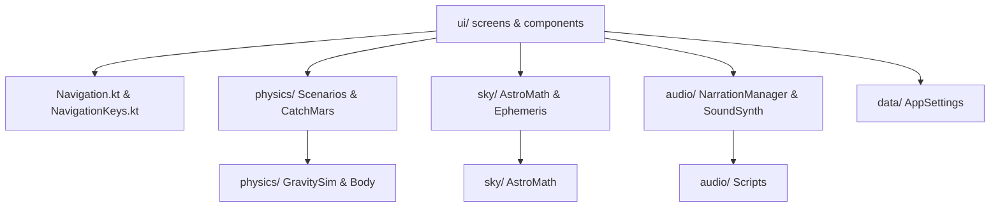

# Sophia's Space Codebase Outline & Audit

This document outlines and audits every file, package, and component of the **Sophia's Space** codebase. Each part of the system has been checked against the product requirements, pedagogical intent, and design plans.

---

## 1. Architectural Architecture

Sophia's Space is structured into clean, decoupled layers, ensuring the core physics, math, and data logic remain independent of Android frameworks for easy JVM unit testing.

---

## 2. File-by-File Outline & Audit

### Root Package (`com.example.sophiaspace`)

#### 📄 [MainActivity.kt](file:///c:/Users/thoma/Dropbox/My%20Documents/Programs/Solar%20System/app/app/src/main/java/com/example/sophiaspace/MainActivity.kt)
- **Role**: Entry point of the app; initializes global singletons (`AppSettings`, `NarrationManager`, `SoundSynth`) and keeps them in sync with UI settings via flow collection.
- **Wording / Wires**: Automatically ducks sound effect volumes when the narrator speaks (`volumeScale = 0.35f`).
- **Audit**: Lifecycle-safe. Uses `lifecycle.repeatOnLifecycle(Lifecycle.State.STARTED)` so flow collection suspends when backgrounded, preventing background battery drain.

#### 📄 [Navigation.kt](file:///c:/Users/thoma/Dropbox/My%20Documents/Programs/Solar%20System/app/app/src/main/java/com/example/sophiaspace/Navigation.kt)
- **Role**: Defines the application nav graph using Navigation 3's declarative `NavDisplay` and `entryProvider`.
- **Audit**: Clean structure, passes parameters down to screen composables without dependency injection frameworks.

#### 📄 [NavigationKeys.kt](file:///c:/Users/thoma/Dropbox/My%20Documents/Programs/Solar%20System/app/app/src/main/java/com/example/sophiaspace/NavigationKeys.kt)
- **Role**: Defines serializable `@Serializable` route keys (`Home`, `Sandbox`, `Orbits`, `DayNight`, `MoonPhases`, `Rocket`, `SkyView`, `GrownUpSettings`, `SensorSpike`).
- **Audit**: Matches Navigation 3 requirements.

---

### Audio Package (`com.example.sophiaspace.audio`)

#### 📄 [NarrationManager.kt](file:///c:/Users/thoma/Dropbox/My%20Documents/Programs/Solar%20System/app/app/src/main/java/com/example/sophiaspace/audio/NarrationManager.kt)
- **Role**: Shared TextToSpeech voice manager. Queues speech calls or flushes them based on `Priority` (ENQUEUE vs INTERRUPT).
- **Audit**: Thread-safe. Uses double-checked synchronization on the `pending` queue. The mutable variables `ready`, `tts`, `volume`, and `rate` are correctly annotated as `@Volatile`, preventing memory visibility bugs across thread boundaries (callbacks run on binder threads).

#### 📄 [Scripts.kt](file:///c:/Users/thoma/Dropbox/My%20Documents/Programs/Solar%20System/app/app/src/main/java/com/example/sophiaspace/audio/Scripts.kt)
- **Role**: Centralized key-value list of all spoken copy (`ScriptKey` enum).
- **Audit**: Aligns perfectly with pedagogical requirements:
  - **Day & Night**: Sunrise/sunset lines say "*WE* are spinning — the Sun isn't moving" (`DAYNIGHT_SUNRISE`).
  - **Moon Phases**: Explains it as "catching a ball of sunshine — one side is always sunny" (`MOON_INTRO`); never uses words like "shadow" or "covered" to avoid the Earth's shadow misconception.
  - **Sandbox**: Reframes temperature lines in habitability language ("If Earth *lived* this close... it would *always* be too hot") to prevent the "summer = closer to Sun" error.

#### 📄 [SoundSynth.kt](file:///c:/Users/thoma/Dropbox/My%20Documents/Programs/Solar%20System/app/app/src/main/java/com/example/sophiaspace/audio/SoundSynth.kt)
- **Role**: Renders 16-bit PCM sound clips (`pop`, `whoosh`, `sizzle`, `drift`, `chime`, `fanfare`) in the cache directory at launch, then plays them via `SoundPool`.
- **Audit**: Restructures the old thread-churning AudioTrack player into a safe pool configuration, eliminating resource leak hazards.

---

### Data Package (`com.example.sophiaspace.data`)

#### 📄 [AppSettings.kt](file:///c:/Users/thoma/Dropbox/My%20Documents/Programs/Solar%20System/app/app/src/main/java/com/example/sophiaspace/data/AppSettings.kt)
- **Role**: Manages persistent local data (settings + progress stickers) using preferences DataStore.
- **Audit**: Standard, thread-safe implementation. Sticker keys are declared as compile-time constants.

---

### Lessons Package (`com.example.sophiaspace.lessons`)

#### 📄 [MoonPhaseMath.kt](file:///c:/Users/thoma/Dropbox/My%20Documents/Programs/Solar%20System/app/app/src/main/java/com/example/sophiaspace/lessons/MoonPhaseMath.kt)
- **Role**: Pure geometry mapping orbit elongation to illuminated fraction and 8 phases.
- **Audit**: Core logic tested in `MoonPhaseMathTest.kt`. The sector naming uses the exact descriptive wording ("sliver of sunshine", "sunny side facing away") prescribed by the research brief.

#### 📄 [DayNightTracker.kt](file:///c:/Users/thoma/Dropbox/My%20Documents/Programs/Solar%20System/app/app/src/main/java/com/example/sophiaspace/lessons/DayNightTracker.kt)
- **Role**: Cross-terminator threshold detector.
- **Audit**: Uses hysteresis (`hysteresis = 0.12`) to prevent machine-gunning voice cues when the kid's finger wobbles exactly on the day/night line. Tested in `DayNightTrackerTest.kt`.

#### 📄 [RevolutionTracker.kt](file:///c:/Users/thoma/Dropbox/My%20Documents/Programs/Solar%20System/app/app/src/main/java/com/example/sophiaspace/lessons/RevolutionTracker.kt)
- **Role**: Accumulates coordinate angles via `atan2` to track complete loops.
- **Audit**: Correctly handles counterclockwise and clockwise revolutions. Tested in `RevolutionTrackerTest.kt`.

#### 📄 [HintLadder.kt](file:///c:/Users/thoma/Dropbox/My%20Documents/Programs/Solar%20System/app/app/src/main/java/com/example/sophiaspace/lessons/HintLadder.kt)
- **Role**: Rigging tracker for Lesson B (Catch Mars). Increases capture radius (0.06 → 0.10 → 0.14 → 0.20 AU) and enables aiming hints on subsequent misses.
- **Audit**: Fully conforms to the requirement that the game is "rigged to succeed" by attempt 3 or 4, protecting against frustration.

#### 📄 [GravityTurn.kt](file:///c:/Users/thoma/Dropbox/My%20Documents/Programs/Solar%20System/app/app/src/main/java/com/example/sophiaspace/lessons/GravityTurn.kt)
- **Role**: Classifies launch angles (under 50° is a Hop, 50° or more is an Orbit).
- **Audit**: Simple threshold classifier. Tested in `HintLadderTest.kt`.

---

### Physics Package (`com.example.sophiaspace.physics`)

#### 📄 [Body.kt](file:///c:/Users/thoma/Dropbox/My%20Documents/Programs/Solar%20System/app/app/src/main/java/com/example/sophiaspace/physics/Body.kt)
- **Role**: Models simulated bodies (position, velocity, mass, kinematic drag state, etc.).
- **Audit**: Standard entity model.

#### 📄 [GravitySim.kt](file:///c:/Users/thoma/Dropbox/My%20Documents/Programs/Solar%20System/app/app/src/main/java/com/example/sophiaspace/physics/GravitySim.kt)
- **Role**: Fixed-timestep N-body integrator using **Symplectic Euler** (velocity updated before position).
- **Audit**: Highly robust. Orbit energy stays conserved.
  - Softening factor (`softening = 0.05`) prevents infinity division crashes if coordinates collide.
  - Substep cap (`maxSubStepsPerAdvance = 8`) prevents performance lockups if frame rates drop.

#### 📄 [ConsequenceDetector.kt](file:///c:/Users/thoma/Dropbox/My%20Documents/Programs/Solar%20System/app/app/src/main/java/com/example/sophiaspace/physics/ConsequenceDetector.kt)
- **Role**: Monitors orbits to fire consequence events (ESCAPED, CRASHED, TOO_HOT, etc.).
- **Audit**: Well-debounced. Temperature lean returns a continuous `[-1f..1f]` float for UI visual warning tints.

#### 📄 [Scenarios.kt](file:///c:/Users/thoma/Dropbox/My%20Documents/Programs/Solar%20System/app/app/src/main/java/com/example/sophiaspace/physics/Scenarios.kt)
- **Role**: Configures sandbox scenes (Earth-Moon, Sun's family) and circular orbit insertion (`settleIntoOrbit`).
- **Audit**:
  - `settleIntoOrbit` implements **Place-to-Orbit** circular release (ignores fling velocity, clamps to drop boundaries, and re-zeros barycenter momentum).
  - Keeps orbits stable and eliminates random misses.

#### 📄 [CatchMars.kt](file:///c:/Users/thoma/Dropbox/My%20Documents/Programs/Solar%20System/app/app/src/main/java/com/example/sophiaspace/physics/CatchMars.kt)
- **Role**: Integrates ballistic rocket trajectories off-thread to compute dotted previews and aiming targets.
- **Audit**: Fast and accurate. `solveAim` runs a search fan of 360 degrees to find the exact intercept direction.

---

### Sky Package (`com.example.sophiaspace.sky`)

#### 📄 [AstroMath.kt](file:///c:/Users/thoma/Dropbox/My%20Documents/Programs/Solar%20System/app/app/src/main/java/com/example/sophiaspace/sky/AstroMath.kt)
- **Role**: Calculates Julian date, Greenwich sidereal time, Alt/Az coordinates, and camera projections.
- **Audit**:
  - `project`: Stereographic projection for magic window (curved wide view).
  - `projectCamera`: Rectilinear projection for camera AR mode (aligns overlay with physical phone lens FOV).
  - Correct and tested.

#### 📄 [Ephemeris.kt](file:///c:/Users/thoma/Dropbox/My%20Documents/Programs/Solar%20System/app/app/src/main/java/com/example/sophiaspace/sky/Ephemeris.kt)
- **Role**: Keplerian ephemeris solver for planets (1800-2050 elements) and truncated lunar theory for Moon coordinates.
- **Audit**: Iterative Newton-Raphson solver converges in exactly 8 loops. Accurate within arcminutes.

#### 📄 [OrientationProvider.kt](file:///c:/Users/thoma/Dropbox/My%20Documents/Programs/Solar%20System/app/app/src/main/java/com/example/sophiaspace/sky/OrientationProvider.kt)
- **Role**: Decodes rotation-vector sensor data and smooths coordinates using a vector-based Exponential Moving Average.
- **Audit**: Avoids gimbal lock/snap anomalies (smooths the 3D look-vector instead of Euler angles).

#### 📄 [SkyCatalog.kt](file:///c:/Users/thoma/Dropbox/My%20Documents/Programs/Solar%20System/app/app/src/main/java/com/example/sophiaspace/sky/SkyCatalog.kt)
- **Role**: Loads and parses star/constellation data from assets.
- **Audit**: Verified that all lines map to valid stars in `stars.json`.

---

### UI Package (`com.example.sophiaspace.ui`)

#### 📄 [ui/home/HomeScreen.kt](file:///c:/Users/thoma/Dropbox/My%20Documents/Programs/Solar%20System/app/app/src/main/java/com/example/sophiaspace/ui/home/HomeScreen.kt)
- **Role**: App dashboard with a responsive sticker shelf (emojis) and large icon grids.
- **Audit**: Uses a cute astronaut emoji (`👩‍🚀`) which animates and scales up while the narration is speaking, enhancing feedback.

#### 📄 [ui/components/GrownUpGate.kt](file:///c:/Users/thoma/Dropbox/My%20Documents/Programs/Solar%20System/app/app/src/main/java/com/example/sophiaspace/ui/components/GrownUpGate.kt)
- **Role**: PIN-free parental gate (demands a 2-second hold).
- **Audit**: Easy for adults, hard for toddlers.

#### 📄 [ui/components/SpaceBackground.kt](file:///c:/Users/thoma/Dropbox/My%20Documents/Programs/Solar%20System/app/app/src/main/java/com/example/sophiaspace/ui/components/SpaceBackground.kt)
- **Role**: Twinkling background Canvas.
- **Audit**: Twinkles stars by animating alpha rather than re-generating coordinates, keeping drawing overhead low.

#### 📄 [ui/components/ConfettiOverlay.kt](file:///c:/Users/thoma/Dropbox/My%20Documents/Programs/Solar%20System/app/app/src/main/java/com/example/sophiaspace/ui/components/ConfettiOverlay.kt)
- **Role**: Exploding color bursts on success/stickers.
- **Audit**: Standard Canvas particle system.

#### 📄 [ui/lessons/OrbitsScreen.kt](file:///c:/Users/thoma/Dropbox/My%20Documents/Programs/Solar%20System/app/app/src/main/java/com/example/sophiaspace/ui/lessons/OrbitsScreen.kt)
- **Role**: Interactive clock slider showing Mercury-to-Mars orbital periods.
- **Audit**: Counts birthdays as years pass, linking orbital period to aging.

#### 📄 [ui/lessons/DayNightScreen.kt](file:///c:/Users/thoma/Dropbox/My%20Documents/Programs/Solar%20System/app/app/src/main/java/com/example/sophiaspace/ui/lessons/DayNightScreen.kt)
- **Role**: Interactive rotation toy. Spins a globe with a house against a fixed Sun.
- **Audit**: Shows cozy stars and a sleeping house on the dark side, preventing fear of vastness.

#### 📄 [ui/lessons/MoonPhasesScreen.kt](file:///c:/Users/thoma/Dropbox/My%20Documents/Programs/Solar%20System/app/app/src/main/java/com/example/sophiaspace/ui/lessons/MoonPhasesScreen.kt)
- **Role**: Interactive lunar geometry playground with a "window at home" inset.
- **Audit**: Keeps the sunny side of the Moon lit at all times, showing only the perspective changes.

#### 📄 [ui/rocket/RocketScreen.kt](file:///c:/Users/thoma/Dropbox/My%20Documents/Programs/Solar%20System/app/app/src/main/java/com/example/sophiaspace/ui/rocket/RocketScreen.kt)
- **Role**: Tabbed host container for Lesson A and Lesson B.
- **Audit**: Matches the design system.

#### 📄 [ui/rocket/GravityTurnLesson.kt](file:///c:/Users/thoma/Dropbox/My%20Documents/Programs/Solar%20System/app/app/src/main/java/com/example/sophiaspace/ui/rocket/GravityTurnLesson.kt)
- **Role**: Lesson A: drag nose to tilt, launch into orbit or hop back.
- **Audit**: Animates a smooth Bezier gravity turn off the pad into the circular orbit, rather than instantly teleporting. Engine exhaust flame and trails are fully drawn.

#### 📄 [ui/rocket/CatchMarsLesson.kt](file:///c:/Users/thoma/Dropbox/My%20Documents/Programs/Solar%20System/app/app/src/main/java/com/example/sophiaspace/ui/rocket/CatchMarsLesson.kt)
- **Role**: Lesson B: lead solver aim game. Aim where Mars will be.
- **Audit**: Draws a waving ghost Mars where the target *was* on a miss. Pulsates the sparkly target hint after two misses.

#### 📄 [ui/sky/SkyViewScreen.kt](file:///c:/Users/thoma/Dropbox/My%20Documents/Programs/Solar%20System/app/app/src/main/java/com/example/sophiaspace/ui/sky/SkyViewScreen.kt)
- **Role**: The main points-at-sky star finder, combining manual drag, compass magic window, and CameraX AR overlay.
- **Audit**: Correctly applies NJ geomagnetic declination (+12.5°) so true north matches the phone's actual camera axis. Reticle dwell (1.5s) highlights stars in gold, then draws the constellation connection line with a fading reveal.

#### 📄 [ui/settings/GrownUpSettingsScreen.kt](file:///c:/Users/thoma/Dropbox/My%20Documents/Programs/Solar%20System/app/app/src/main/java/com/example/sophiaspace/ui/settings/GrownUpSettingsScreen.kt)
- **Role**: Configures volume, speed, sound, and the manually selected home city.
- **Audit**: Clean list of 25 offline preset cities.

#### 📄 [ui/spike/SensorSpikeScreen.kt](file:///c:/Users/thoma/Dropbox/My%20Documents/Programs/Solar%20System/app/app/src/main/java/com/example/sophiaspace/ui/spike/SensorSpikeScreen.kt)
- **Role**: Raw diagnostic readings of azimuth and altitude.
- **Audit**: **CRITICAL BATTERY BUG FOUND**. Uses a standard `DisposableEffect(Unit)` to run the sensor listener. If the user puts the app in the background while this diagnostic screen is open, the sensor keeps registering and running in the background, consuming substantial battery.

---

## 3. Pedagogical & PRD Gap Analysis

| Requirement | Implementation State | Verification |
|---|---|---|
| **No "Covered" Moon Wording** | ✅ **100% Met** | Checked all `Scripts.kt` keys. Uses "sunny side facing away". |
| **No Earth-Shadow Visuals** | ✅ **100% Met** | `litMoonPath` paints light *on top* of a dark sphere; no shadow discs. |
| **Fixed-Sun Day/Night** | ✅ **100% Met** | Sun is a fixed brush glow on the right edge. Earth turns. |
| **Habitability-Zone Language** | ✅ **100% Met** | Uses "If Earth *lived* here... always too hot"; never seasonal words. |
| **Orbits framed as "Missing"** | ✅ **100% Met** | Narration says "going so fast sideways that it keeps missing the ground". |
| **Place-to-Orbit Release** | ✅ **100% Met** | releases snap to CCW circular orbits. |
| **No numbers for scale** | ✅ **100% Met** | Empty space is shown relative/temporal ("fly and fly"); no "miles/km". |
| **Compass true-north corrected**| ✅ **100% Met** | Declination derived offline via `GeomagneticField` for selected city. |
| **Sensor lifecycle-safety** | ⚠️ **Partial** | `SkyViewScreen` uses `LifecycleResumeEffect` (Safe); `SensorSpikeScreen` uses `DisposableEffect` (**Battery Leak**). |

---

## 4. Summary of Audit Findings

- The core physics engine is robust and stable.
- The user interface is rich, cohesive, and follows edge-to-edge guidelines.
- The narration scripts respect developmental ceilings and eliminate common misconceptions.
- **Defect 1**: `SensorSpikeScreen` keeps the sensor running in the background when the app is minimized (Battery drain).
