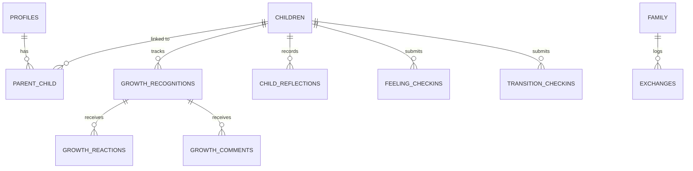

# OtterLink V2 Rebuild Plan: Child-Centered Growth & Parent Alignment

OtterLink is transitioning away from a traditional calendar/chore-board tool. The new V2 product mission is to **help parents raise children consistently across households** by prioritizing **recognition over correction** and making parental alignment visible to the child. 

This document serves as the live, interactive architectural blueprint and build plan for V2, spanning 6 targeted sprints.

---

## 🏛️ V2 Core Pillars & Design Aesthetics
To align with the high-trust product vision, OtterLink V2 adopts a **premium, calming, legal-grade SaaS aesthetic** (resembling high-end collaboration platforms like Notion or Linear):
* **Colors:** Deep slates (`#0f172a`), serene charcoals (`#1e293b`), rich gold/amber accents (`#d97706`), and soft neutral background grids (`bg-slate-50/50 dark:bg-slate-950/20`).
* **Typography:** Clean, balanced sans-serif hierarchy (Outfit or Inter) utilizing generous letter-spacing, lowercase badges, and clean border separations.
* **Layouts:** Focus on emotional safety, structured clarity, and breathing space. Zero cartoony elements, bright neon buttons, or gamified leaderboards.

---

## 🚨 User Review Required

> [!IMPORTANT]
> **Shift to Child-Centered Architecture:**
> The primary database models will shift from routing operations via parent-centric schemas to indexing all recognitions, alignment stats, and journey timelines directly under `child_id`. This establishes a single high-trust database index that both parents securely interact with.

> [!WARNING]
> **AI Exposure Control (OQ-02):**
> We are suggesting an **"Invisible Recommendation Engine"** hybrid model. The AI will translate onboarding questions and log entries under the hood (e.g. mapping "Sophia packed her backpack herself" to "Confidence") without displaying a chat bubble. This preserves the legal-grade legitimacy of parenting documentation. Let us know if you prefer a fully visible assistant instead!

---

## ❓ Open Questions & Design Decisions

### OQ-01: Terminology Selection
* **Current Concept:** "Gold Sticker"
* **Proposed Alternatives:** we recommend using **"Milestone Logs"** or **"Growth Spotlights"** in the parent dashboard, and **"Proud Moments"** or **"Parent Spotlights"** in the Child Space. This avoids gamification and emphasizes authentic visibility.
* *Please advise on your preferred naming before Sprint 2.*

### OQ-03: Child Space Data Privacy
* **Concept:** Should child reflections (e.g. feelings, private drawings, voice notes) be fully visible to both parents?
* **Recommendation:** All emotional check-ins and shared moments are visible in the **Shared Feed** by default to maintain absolute co-parenting transparency, but child "Proud Moments" can have an optional "Draft" mode before being published to both parents.

---

## 🛠️ Proposed Database Schema Extensions
To support V2's rich mechanics, we will add the following tables and relation layers inside Supabase:



### 1. `shared_values_profiles` (Values Setup)
* `id` (uuid, primary key)
* `family_id` (uuid, foreign key)
* `values` (text[], e.g., `['communication', 'confidence', 'resilience']`)
* `created_at` (timestamp)

### 2. `parent_alignment_profiles` (Onboarding Survey)
* `id` (uuid, primary key)
* `user_id` (uuid, foreign key to auth.users)
* `child_id` (uuid, foreign key to children)
* `desired_outcomes` (text)
* `parenting_priorities` (text)
* `shared_goals` (text)
* `created_at` (timestamp)

### 3. `growth_recognitions` (Primary Loop Core Object)
* `id` (uuid, primary key)
* `child_id` (uuid, foreign key to children)
* `created_by` (uuid, foreign key to profiles)
* `what_happened` (text)
* `importance` (text, optional)
* `tags` (text[])
* `mapped_traits` (text[], e.g., `['Confidence', 'Resilience']` via local AI classifier)
* `created_at` (timestamp)

### 4. `feeling_checkins` (Child Space Emotions)
* `id` (uuid, primary key)
* `child_id` (uuid, foreign key to children)
* `feeling` (text, e.g., `['Happy', 'Worried', 'Tired']`)
* `notes` (text, optional)
* `created_at` (timestamp)

### 5. `exchanges` (Transition Tracking logs)
* `id` (uuid, primary key)
* `family_id` (uuid)
* `logged_by` (uuid, foreign key to profiles)
* `rating` (text, e.g., `['Smooth', 'Minor Challenge', 'Difficult']`)
* `communication` (text, e.g., `['Positive', 'Neutral', 'Tense']`)
* `notes` (text)
* `created_at` (timestamp)

---

## 🚀 Proposed Changes (File Modifications)

### Component: Onboarding & Family Foundation
#### [NEW] [OnboardingWizard.tsx](file:///c:/Users/thoma/Dropbox/My%20Documents/Websites/OtterLink/Site%20Files/src/components/dashboard/OnboardingWizard.tsx)
* Wizard mapping to Module A. Collects shared values, user demographics, and feeds details directly to the parenting questionnaire.
#### [NEW] [AlignmentQuestionnaire.tsx](file:///c:/Users/thoma/Dropbox/My%20Documents/Websites/OtterLink/Site%20Files/src/components/dashboard/AlignmentQuestionnaire.tsx)
* Captures and compares desired outcomes, priorities, and shared goals between co-parents. Provides visual overlay comparison.

---

### Component: Growth Recognition System
#### [NEW] [GiveRecognitionDialog.tsx](file:///c:/Users/thoma/Dropbox/My%20Documents/Websites/OtterLink/Site%20Files/src/components/dashboard/GiveRecognitionDialog.tsx)
* Multi-step dialog to enter "What happened?", custom tags, and trigger the AI mapping.
#### [MODIFY] [Dashboard.tsx](file:///c:/Users/thoma/Dropbox/My%20Documents/Websites/OtterLink/Site%20Files/src/pages/Dashboard.tsx)
* Update to host the new V2 Unified Parent Feed showing growth recognitions, alignment indexes, and fast transition cues.

---

### Component: Child Space & Transition Tracking
#### [NEW] [ChildSpace.tsx](file:///c:/Users/thoma/Dropbox/My%20Documents/Websites/OtterLink/Site%20Files/src/pages/ChildSpace.tsx)
* Safe, child-friendly layout containing **My Journey**, **What People Noticed**, and emotional check-in modules.
#### [NEW] [TransitionTracker.tsx](file:///c:/Users/thoma/Dropbox/My%20Documents/Websites/OtterLink/Site%20Files/src/components/dashboard/TransitionTracker.tsx)
* Parent post-exchange reflection capture along with child pre-exchange feeling check-in options.

---

### Component: Developmental Visualization
#### [NEW] [GrowthJourney.tsx](file:///c:/Users/thoma/Dropbox/My%20Documents/Websites/OtterLink/Site%20Files/src/pages/GrowthJourney.tsx)
* Sleek developmental timeline visualizing traits (Communication, Confidence, Resilience, Respect, Understanding) using a beautiful premium "Constellation" mapping interface.

---

## 🏁 Verification Plan

### Automated Build Verification
We will programmatically ensure that our database additions, typescript typings, page route inclusions, and Tailwind parameters compile successfully with zero errors:
```powershell
# Mandatory verification compile:
Remove-Item -Path "dist" -Recurse -Force -ErrorAction SilentlyContinue
npm run build
```

### Manual Visual Verification
1. **Security Context Integrity:** Verify that non-secure UUID helper scripts support child and parent record linking successfully on Ionos staging.
2. **Multi-Parent Alignment Test:** Test with dual-active browser sessions to verify that co-parent reactions, comments, and values mapping are updated in real-time.
3. **Clean Assets Verify:** Verify that all old hashed packages in `y:\otterlink\assets\` are removed on compilation deployment.
