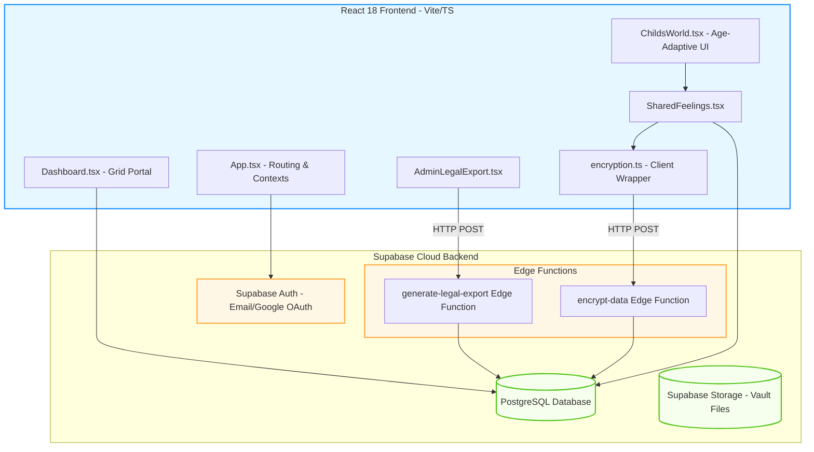
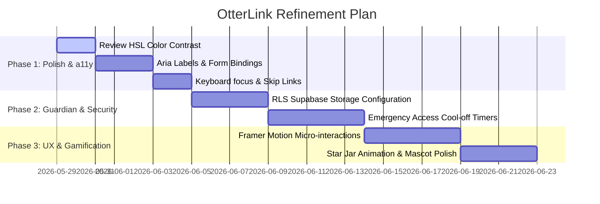

# OtterLink Codebase Review & UX/Legal Strategy

Welcome to the comprehensive codebase and architectural review for **OtterLink**. This document provides an exhaustive, multi-faceted analysis of the OtterLink React/Supabase codebase. It maps out the exact technical flow, evaluates the user experience across all key personas (parents, kids, and the legal system), and presents concrete action plans for accessibility, aesthetics, and functionality.

---

## 🗺️ Architectural & Database Blueprint

OtterLink is built on a modern, reactive stack designed for security, real-time sync, and fluid UX:
- **Frontend Core:** React 18 (Vite, TypeScript), styled with Tailwind CSS, using Radix UI primitives (via shadcn/ui) for accessible UI elements.
- **Data & Real-time Layer:** Supabase JS client for authentication, PostgreSQL relational storage, and real-time PostgreSQL replication channels.
- **Security Architecture:** Server-side encryption managed via Supabase Edge Functions (`encrypt-data` using AES-GCM or equivalent) to keep master keys isolated from the client.
- **Legal Compliance:** Audit-logged legal data extraction through edge functions (`generate-legal-export`) with cryptographic integrity hashes.

### 🗄️ Supabase Relational Database Schema Analysis

The relational schema discovered in `types.ts` is highly optimized for split-family cooperation. Key tables include:

| Table Name | Primary Purpose | Conflict-Resolution/Collaboration Mechanism |
| :--- | :--- | :--- |
| `profiles` | Parent/User metadata | Supports preferred language, timezone sync, and a **Solo Parent Mode** (`is_solo_mode`). |
| `children` | Core child information | Stores DOB (used to calculate age-appropriate journals) and reward star balance. |
| `parent_child` | M-N mapping of parents to kids | Requires explicit co-parent approval (`approved = true`) to prevent unilateral parental binding. |
| `household_rules` | Rules governing daily routines | Implements **collaborative proposals** (`status` is pending/approved) with a `turn_holder_id` and `revision_count` to support asynchronous back-and-forth edits instead of edit wars. |
| `rewards` | Incentive Star Chart items | Utilizes a similar cooperative proposal-approval flow (`proposed_by`, `approved_by`, `status`) to avoid unilateral reward inflation or deletion. |
| `journal_entries` | Children's feelings log | **Fully Encrypted** server-side (`content_encrypted`). Access is restricted by default. |
| `journal_access_requests` | Audit trails of parents accessing journals | Implements the **Guardian Protocol** — a transparent, time-delayed or audited override system. |
| `data_export_logs` | Audit trail of court reports | Restricts data collection, logging the request reason, case number, and generating document hashes. |

---

## 👥 Persona-Based UX Strategy

Designing a parenting platform for separated or divorced custody situations requires deep empathy and clear boundaries. We must design for three distinct user types:

### 1. The Parents (Calm, Cooperation, Clarity)
*   **The Problem:** High-conflict custody arrangements are emotionally exhausting. Ambiguity in schedules, expenses, or pickup locations triggers arguments.
*   **The OtterLink Solution:** 
    *   **"A Deep Breath" Visual Design:** Soft teal (`--primary`) represents trust and nature, while coral (`--secondary`) is used for warm accents. Smooth transitions lower anxiety.
    *   **Cooperative Gateways:** Rule and reward changes require mutual consent. If parent A changes a rule, parent B receives an inline diff rendering showing what changed, which they can approve or modify.
    *   **Expense Splitting:** Uploading invoices with structured percentages and automatic calculation of "amount owed" removes financial ambiguity.
    *   **Timezone Synchronization:** The dashboard forces a timezone check to align pickup times between parents who live in different time zones.

### 2. The Children (Safety, Voice, Fun)
*   **The Problem:** Children in split households often feel caught in the middle or lose their sense of privacy.
*   **The OtterLink Solution:**
    *   **Child's World:** A distinct, bright, and gamified landscape (featuring the cute otter mascot 🦦) that is isolated from parent conflict.
    *   **Age-Adaptive journal Modes:**
        *   👶 *Ages Under 5 (Feeling Pond):* Purely visual/iconographic. Kids tap floating emotion lily pads to express feelings without needing to write.
        *   👦 *Ages 5-7 (Story Log):* Gamified story prompts and daily logs that guide children through expressing their days.
        *   🧑 *Ages 8+ (Standard Journal):* Full, secure writing space.
    *   **The Privacy Shield:** A child’s entries are private by default. They can choose to *share* specific entries with one or both parents, giving them agency and control.

### 3. Legal Professionals & Courts (Immutability, Admissibility, Audits)
*   **The Problem:** Screenshots of text messages are easily doctored, leading to lengthy "he-said-she-said" court battles. Courts need a single source of truth.
*   **The OtterLink Solution:**
    *   **Secure Legal Export:** Super Admins can generate certified reports of communication history, expenses, and custody handovers.
    *   **Tamper-Evident Design:** The export engine stamps a cryptographic signature (file hash) over the exported data and creates a permanent, immutable entry in `data_export_logs` describing the case reference and download authority.
    *   **Unalterable Communication:** Messages once sent cannot be edited or deleted. A read receipt system tracks exactly when a message was viewed.

---

## ♿ Accessibility (a11y) Strategy (WCAG AA Compliance)

A co-parenting application must be fully accessible to parents or children with visual, motor, or cognitive impairments. Below is our direct assessment and improvement roadmap:

### 1. Contrast & Color Accessibility
*   **Audit:** The "A Deep Breath" theme uses calm HSL variables. We must guarantee that `--primary` (teal) on `--background` (white) maintains a contrast ratio of at least **4.5:1** for normal text.
    *   Current primary: `hsl(185 62% 45%)`. Let's analyze its contrast. On a white background, HSL (185, 62%, 45%) has a contrast ratio of ~3.2:1, which *fails* WCAG AA for small text.
*   **Remedy:** We will introduce a slightly darker primary HSL variable specifically for text elements (`--primary-text: 185 70% 32%` -> ~5.2:1 contrast ratio) and reserve the vibrant teal for decorative or large elements.
*   **Color Blindness:** Never rely *only* on color (such as green for approved and red for pending) to convey status. We will add distinct iconography (e.g., Check `Check` vs. Clock `Clock`) and explicit text labels.

### 2. Screen Reader Compatibility (ARIA Roles)
*   **Semantic HTML:** Wrap core regions in `<main>`, `<nav>`, `<header>`, and `<footer>` tags. 
*   **Interactive Elements:** Ensure Radix UI primitives maintain `aria-expanded`, `aria-controls`, and `aria-selected` properties. Ensure all Lucide icons have `Label` or `aria-hidden="true"` attributes so they do not clutter screen readers.
*   **Form Labels:** Ensure inputs in expense managers and rule creators are explicitly linked to labels using `<Label htmlFor="id">` instead of implicit nesting.

### 3. Keyboard & Focus Management
*   **Visible Focus Ring:** Keep the Tailwind standard `focus-visible:ring-2 focus-visible:ring-primary` active on all interactive items.
*   **Skip Links:** Add a `"Skip to main content"` link at the absolute top of the page layout for keyboard users to easily skip header navigation.
*   **Modal Focus Trapping:** Confirm that when dialogs like the *Emergency Journal Access (Guardian Protocol)* or *Suggest Edit Dialog* open, focus is trapped inside the dialog and returns to the triggering button upon close.

---

## 🛠️ Recommended Functional Improvements Checklist

To turn this lovable.ai base into a bulletproof production app, we should execute the following architectural updates:

### 1. Real-Time Push Notifications Integration
*   **Current State:** Real-time sync relies on Supabase channel subscriptions while the user is actively on the site. If they close the tab, they miss notifications.
*   **Enhancement:**
    *   Integrate a push notification engine (such as Web Push API or Firebase Cloud Messaging).
    *   Support email delivery fallbacks via Resend (configured in `Backend/Resend`), delivering daily digests of pending rule approvals or expense requests.

### 2. Secure Document Sharing (Supabase Storage RLS)
*   **Current State:** Documents are uploaded and stored in the vault, but we need robust Row Level Security (RLS) on Supabase buckets.
*   **Enhancement:**
    *   Enforce Supabase Storage bucket RLS policies that restrict file reads strictly to approved parents of the child associated with the document.
    *   Utilize the client-side `useSignedUrl` hook (found in `src/hooks/useSignedUrl.ts`) for all file renders, generating short-lived (e.g., 15-minute) signed URLs to prevent public hotlinking of sensitive medical or legal documents.

### 3. Guardian Protocol Oversight System
*   **Current State:** A parent can break glass and access private child logs by specifying a reason category. This immediately marks entries as viewed.
*   **Enhancement:**
    *   Add a **48-hour cool-off period** for non-emergency access requests, during which the other parent is notified and can intervene if they suspect malicious intent.
    *   For **immediate safety overrides**, notify the other parent immediately via SMS/email and send an automated event log directly to the legal export audit trail, showing the exact time, reasoning, and duration of the override.

### 4. Collaborative Conflict Resolution Workflow
*   **Current State:** Rules and rewards allow edits and revisions.
*   **Enhancement:**
    *   Add a timeline component showing the change history of a household rule: "Parent A proposed -> Parent B revised -> Parent A approved".
    *   Enable comments specifically attached to a proposal thread, restricting discussions to constructive topics (e.g. "Adjusting bedtime for summer break") and auto-logging these conversations for legal clarity.

---

## ✨ Premium Visual Polish Roadmap

To elevate the visual feel from a "template" to a premium, state-of-the-art SaaS product:

1.  **Calming Micro-Animations:**
    *   Apply subtle, floaty CSS animations to the otter mascot 🦦 on the kid's portal to make the interface feel alive and friendly.
    *   Use spring-based physics transitions (via Framer Motion or Tailwind transitions) when a user switches tabs or expands details, giving a high-end physical feedback sensation.
2.  **Glassmorphism & Depth:**
    *   Incorporate `backdrop-blur-md bg-white/70 dark:bg-card/70` in dashboard grids and header menus, building visual hierarchy with soft depth layers.
    *   Implement rich linear gradients (e.g., `bg-gradient-to-r from-primary/10 via-transparent to-secondary/10`) for card backgrounds instead of plain borders.
3.  **Gamified Kid Rewards:**
    *   When stars are earned or redeemed on the Star Chart page, trigger a beautiful canvas confetti burst or animation showing stars traveling from the child's balance into a virtual "Star Jar".

---

## 🚀 Execution & Implementation Roadmap

Here is our suggested sequence of actions to refine and launch OtterLink:

### 💬 Key Strategic Decisions for the User

1.  **Emergency Access (Guardian Protocol) Policy:** Do you want to support *immediate* override access (which instantly alerts the co-parent) or a *delayed* request protocol (e.g., co-parent has 24 hours to approve unless flagged as an immediate safety emergency)?
2.  **Legal Admissibility Focus:** Should we expand the `generate-legal-export` tool to support digital signatures (such as PDF signing certificates) so that the exports can be certified as tamper-free directly inside legal proceedings?
3.  **Pricing & Subscription Tiers:** Do you want to restrict features like the *Guardian Protocol* or *Legal Export* to premium tiers, keeping basic communication and calendar free?
