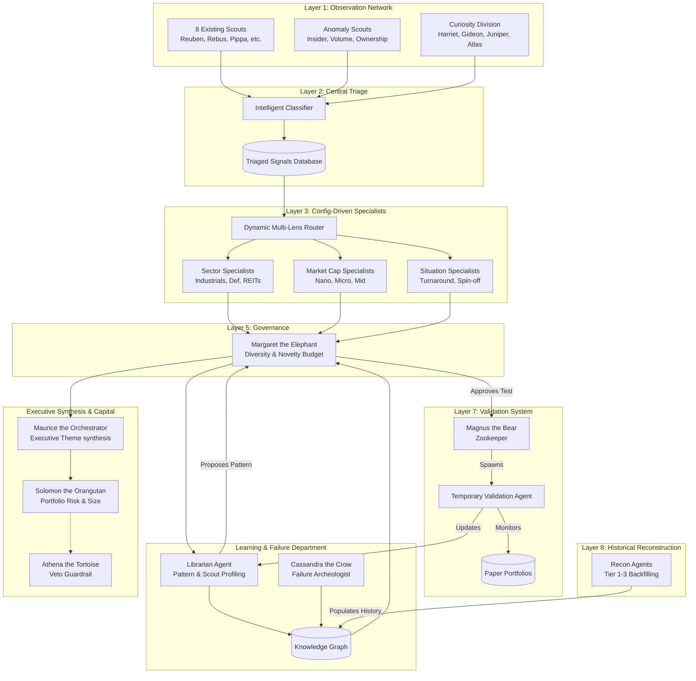

# TMM Evolution Blueprint: Self-Improving Market Intelligence Ecosystem

This document details the architectural specification, data schemas, mathematical formulations, and engineering roadmap to transition the **Trained Market Monkey (TMM)** platform from a static 17-agent stock research pipeline into a self-improving, knowledge-accumulating market intelligence ecosystem.

---

## 1. System Topology

The diagram below maps the data flows, feedback loops, and cognitive safeguards across the eight active layers of the future TMM ecosystem.



---

## 2. Foundational Philosophy: Knowledge Over Newsletter

In the legacy TMM design, the end-state metric was the publication of a high-quality daily newsletter dossier. In the evolved system, **the newsletter is a byproduct. The primary asset is the Knowledge Graph.**

*   **Principe 1 (No Ingest Leak):** All signals, regardless of whether they pass triage confidence metrics, are preserved in the data lake.
*   **Principle 2 (Earned trust):** No analytical pattern remains static. Every pattern is treated as an active hypothesis subjected to continuous backtesting.
*   **Principle 3 (Symmetry of Outcome):** False positives (buys that crashed) and false negatives (watches that exploded) are treated as higher-value training data than simple wins.
*   **Principle 4 (Enforced Discomfort):** The system must allocate compute to scanning sectors and situations that are currently showing the lowest familiarity metrics.

---

## 3. Data Schemas & Routing Specifications

### 3.1. Layer 2: Intelligent Signal Triage Schema
Every incoming observation compiled by the Scouts must be normalized, classified, and tagged.

```json
{
  "$schema": "https://trainedmarketmonkey.com/schemas/triaged-signal.json",
  "signal_id": "sig_20260530_9831a2",
  "timestamp": "2026-05-30T09:12:00Z",
  "scout_id": "rebus_v3",
  "ticker": "ATOM",
  "company": "Atomera Inc",
  "sector": "Semiconductors",
  "market_cap_category": "Micro",
  "confidence_score": 8,
  "novelty_score": 88,
  "familiarity_score": 12,
  "situations": [
    "Patent Cluster",
    "Insider Buying"
  ],
  "raw_cites": [
    "US 11,482,593",
    "Form 4: 2026-05-28"
  ],
  "payload": {
    "summary": "Atomera assignee records show a sudden cluster of 3 process node optimization patents, backed by insider buying of $45k by the CTO.",
    "raw_data_hash": "e3b0c44298fc1c149afbf4c8996fb92427ae41e4649b934ca495991b7852b855"
  }
}
```

### 3.2. Layer 3: Configuration-Driven Specialist Engine
To prevent code sprawl, specialists are defined as configuration objects parsed by a shared execution engine.

```json
{
  "$schema": "https://trainedmarketmonkey.com/schemas/specialist-definition.json",
  "specialist_id": "spec_micro_insider",
  "display_name": "Slick the Ferret",
  "archetype": "Insider Turnaround Sleuth",
  "voice_prompt_path": "config/voices/ferret.txt",
  "filter_criteria": {
    "market_cap": ["Nano", "Micro"],
    "situations": ["Insider Buying", "Turnaround", "Distressed"]
  },
  "required_scout_corroboration": {
    "min_count": 2,
    "allowed_scouts": ["rebus_v3", "pippa", "cleo", "wendell"]
  },
  "signature_apparatus": {
    "name": "THE CO-INVESTMENT MATRIX",
    "steps": [
      "Verify insider buying volume relative to average salary",
      "Check patent cluster alignment with hiring requirements",
      "Assess 3-year bankruptcy risk via Altman Z-score"
    ]
  },
  "validation_prompts": {
    "bull_case": "Explain why the market is mispricing this insider transaction.",
    "bear_case": "Is this insider transaction a promotional signal to keep the stock afloat?"
  }
}
```

---

## 4. Architectural Layer Specifications

### Layer 1: Expanded Observation Network
The network is split into two specialized hunting divisions:
1.  **Anomaly Division**: Programmatic scouts tracking insider transactions (Form 4), volume breakouts (trading > 300% of 50-day average), institutional/ownership changes (13F/13G), and sell-side analyst initiation/coverage gaps.
2.  **Curiosity Division**:
    *   **Harriet the Magpie**: Scrapes trade journals and niche industrial newsletters.
    *   **Gideon the Mole**: Pulls construction permits, environmental impact filings, and zoning approvals.
    *   **Juniper the Fox**: Tracks developer channels and supply-chain chatter on specialized forums.
    *   **Atlas the Stork**: Monitors global shipping, factory completions, and warehouse expansions.

### Layer 2: Intelligent Signal Triage
The triage engine acts as the gatekeeper. Signals are normalized, matching against a strict market-cap taxonomy:
*   **Nano-cap**: < $50M
*   **Micro-cap**: $50M - $300M
*   **Small-cap**: $300M - $2B
*   **Mid-cap**: $2B - $10B
*   **Large-cap**: > $10B

### Layer 3: Dynamic Multi-Lens Routing
When a triaged signal enters the queue, the **Dynamic Routing Engine** matches it against all configuration-driven specialists simultaneously:

```
[Signal: XYZ (Micro-Cap Industrial + Insider Buy)]
           |
           +--> Micro-Cap Specialist (Edith Profile) ---> dossier_part_1.json
           +--> Industrials Specialist (Tando Profile) --> dossier_part_2.json
           +--> Insider Specialist (Cleo Profile) ------> dossier_part_3.json
           |
      [Consolidation Engine] ---> Final Triangulated Dossier with Consensus/Disagreement
```

### Layer 4: The Librarian Department & Knowledge Graph
*   **Role**: Analyzes the relationship between triaged signals and ultimate 90-day price outcomes.
*   **Scout Effectiveness Score**: Computed as:
$$\text{SES}_s = \frac{\sum (\text{Confidence} \times \text{Outcome})}{\text{Signals Generated}}$$
*   **Knowledge Graph Schema**: Managed as a graph structure representing nodes (`Observation`, `Outcome`, `Sector`, `MarketCap`, `Situation`, `Agent`, `Pattern`, `AntiPattern`, `Regime`) and directed edges (`TRIGGERED_BY`, `CORROBORATED_WITH`, `CONTRASTED_BY`, `RESOLVED_INTO`).

### Layer 5: Margaret's Governance & Diversity Scoring
Margaret dynamically adjusts the pipeline's attention. If the portfolio or research history is heavily concentrated in a single sector or ticker, she reduces its compute budget.
*   **Familiarity Score Calculation**: Every time a ticker is researched, its familiarity score ($F$) decays upward:
$$F_{t+1} = F_t + (1 - F_t) \times \lambda$$
    Where $\lambda \in [0.1, 0.3]$. Higher familiarity reduces the chance of selection.
*   **Exploration Quota**: Margaret enforces a strict **25% compute budget** that must be spent on tickers where $F_t < 0.15$.

### Layer 6: Failure System & Cassandra the Crow
*   **Role**: Performs post-mortem analyses on all false positives.
*   **Failure Cataloging**: Cassandra analyzes the difference between the Specialist's thesis and real-world outcomes. She maintains the **Anti-Pattern Library** (e.g. *"The Promotional Biotech Pump"*, *"The Overleveraged Utility Value-Trap"*).

### Layer 7: The Pattern Validation Lifecycle
Validation follows a strict programmatic progression:

```
Librarian Discovers Pattern
  ↓
Margaret Challenges Pattern (Sets null hypothesis)
  ↓
Magnus Spawns Temporary Validation Agent
  ↓
Paper Portfolio Monitoring (Runs for 90-180 Days)
  ↓
Passes Target Alpha?
  ├── Yes: Pattern Promoted to Specialist Core
  └── No: Pattern Retired to Failure Library
```

### Layer 8: Historical Reconstruction & Fidelity Model
Reconstruction agents generate historical graphs to backfill market contexts under different macro regimes (e.g. 2008 crash, 2020 liquidity event):
*   **Tier 1 (0-5 Years)**: Full data resolution, daily price tracking, all hiring logs, and SEC records.
*   **Tier 2 (5-10 Years)**: Weekly price tracking, major patent clusters, and corporate filings.
*   **Tier 3 (10-25 Years)**: Regime-level tracking (interest rates, commodity super-cycles, macro indicators).

---

## 5. Portfolio & Compute Allocation Model

### 5.1. Compute Budget Allocations
To maximize learning and portfolio performance, Magnus and Margaret allocate the desktop's execution capacity according to five operational budgets:

| Budget Division | Weight | Target Objective | Control Agent |
| :--- | :--- | :--- | :--- |
| **Conviction Research** | 40% | High-conviction specialist picks based on established, highly-correlated patterns. | Maurice / Vint / Henrietta |
| **Exploration Division** | 25% | Scanning low-familiarity sectors, nano-caps, and neglected publications. | Margaret / Harriet / Gideon |
| **Active Validation** | 20% | Running temporary agents to validate newly discovered patterns in paper portfolios. | Magnus / Librarian |
| **Historical Reconstruction** | 10% | Backfilling historical graph databases for macroeconomic regime alignment. | Tier 1-3 Recon Agents |
| **Experimental Sandbox** | 5% | Permuting specialist prompt structures and testing highly speculative signal overlays. | Magnus / Cassandra |

### 5.2. Future Capital Allocation: Solomon & Athena
To safeguard future assets, the investment engine is strictly separated from the research loop:
1.  **Solomon the Orangutan (Chief Investment Officer - `solomon.py`)**: Responsible for position sizing, liquidity analysis, drawdown limits, and cash allocation. It parses research dossiers but cannot modify the patterns that generated them.
2.  **Athena the Tortoise (Risk Officer - `athena.py`)**: Responsible for vetoing capital allocation decisions. Athena analyzes concentration risk, asset correlations, and macro regime risk.

---

## 6. Execution State Transition: The Farm System

Observations are promoted through a clear structural pipeline:

```
[Observed Signal] ──(Novelty Check)──> [Watchlist] ──(Scout Corroboration)──> [Research Candidate]
                                                                                   │
                                                                           (Multi-Lens Routing)
                                                                                   ▼
[Publication] <──(Margaret Fit Audit)── [Publication Candidate] <── [Deep Investigation]
     │
     ▼
[Monitoring Campaign] ──(90-Day Outcome Triage)──> [Historical Archive]
```

---

## 7. Complete 10-Sprint Evolution Plan

```
                  S1: Specialist Refactor (Configuration-Driven Routing Engine)
                     S2: Graph Foundation & Observation Schema Design
                        S3: Farm System Progression Engine Implementation
                           S4: Librarian Department & Scout/Specialist Scoring
                              S5: Margaret Expansion (Diversity, Familiarity & Curiosity)
                                 S6: Pattern Validation Infrastructure & Paper Portfolios
                                    S7: Failure Archaeology & Cassandra the Crow
                                       S8: Historical Reconstruction Engine (Tier 1-3)
                                          S9: Curiosity Division & Anomaly Scouts
                                             S10: Agent Spawning & Lifecycle Manager
```

### Sprint 1: Architectural Refactor & Routing Engine
*   **Goal**: Design the shared specialist engine and implement the dynamic, multi-lens router.
*   **Deliverables**:
    *   `config/specialists/`: JSON-based directory containing specialist configurations.
    *   `utils/router.py`: The routing engine that reads triaged signals and distributes them to appropriate specialists.
    *   `utils/specialist_engine.py`: A single shared script that runs specialist LLM logic based on configuration payloads, completely eliminating individual specialist file sprawl.

### Sprint 2: Knowledge Foundation
*   **Goal**: Establish database schemas for observations, outcomes, and the baseline knowledge graph.
*   **Deliverables**:
    *   `data/archive/`: Root folder for raw observations.
    *   `utils/graph_manager.py`: Baseline graph API supporting node insertion and edge relationship mapping using a local SQLite/NetworkX back-end.

### Sprint 3: Farm System Implementation
*   **Goal**: Build the progression engine to transition tickers through observed, watchlist, and deep investigation states.
*   **Deliverables**:
    *   `data/farm_system.json`: The state database tracking all tickers.
    *   `utils/lifecycle_engine.py`: Transition manager that triggers alerts when a watchlist ticker secures a new, corroborating scout signal.

### Sprint 4: The Librarian Department
*   **Goal**: Implement the Librarian agent to profile scout/specialist scoring and trace alpha trends.
*   **Deliverables**:
    *   `agents/librarian.py`: Agent that evaluates outcome correlations at the end of the 90-day cycle.
    *   `data/pattern_repository.json`: Active library tracking confirmed patterns and their historical success rates.

### Sprint 5: Margaret's Expansion
*   **Goal**: Implement the exploration engine, familiarity decay system, and curiosity budgets.
*   **Deliverables**:
    *   `utils/exploration_engine.py`: Enforces diversity and novelty limits, blocking large-cap focus and calculating dynamic ticker familiarity scores.
    *   Update `margaret.py` to act as the Anti-Echo-Chamber Officer, enforcing the 25% exploration compute budget.

### Sprint 6: Pattern Validation Framework
*   **Goal**: Develop the paper portfolio monitoring manager and validation agent lifecycle.
*   **Deliverables**:
    *   `utils/validation_manager.py`: Spawns temporary paper portfolio validation runs.
    *   `data/paper_portfolios/`: Directory tracking active simulated investments and pattern performance.

### Sprint 7: Failure System (Cassandra the Crow)
*   **Goal**: Spawn Cassandra the Crow and establish the failure and false-positive archeology library.
*   **Deliverables**:
    *   `agents/cassandra.py`: Failure analysis engine.
    *   `data/anti_patterns/`: Folder housing detailed profiles of failed investment structures and false positives.

### Sprint 8: Historical Reconstruction Engine
*   **Goal**: Create Tier 1-3 historical reconstruction agents to backfill historical graph states.
*   **Deliverables**:
    *   `agents/reconstruction_agents.py`: Backfill scripts for Tier 1 (5 years), Tier 2 (5-10 years), and Tier 3 (10-25 years).
    *   `data/graph_backfill.db`: Historical macro-regime graph database.

### Sprint 9: Curiosity Network Expansion
*   **Goal**: Add anomaly scouts and launch the curiosity division scouts (Harriet, Gideon, Juniper, Atlas).
*   **Deliverables**:
    *   `agents/scouts_curiosity/`: Subdirectory housing curiosity division scrapers and pipelines.
    *   `utils/anomaly_scanners.py`: Programmatic scanner scripts tracking Form 4s and volume breakouts.

### Sprint 10: Evolution Framework
*   **Goal**: Deploy the agent lifecycle manager to dynamically spawn, split, merge, or retire specialists.
*   **Deliverables**:
    *   `utils/evolution_manager.py`: Orchestrates agent configuration transformations under Magnus and Margaret's supervision, ensuring TMM is fully self-improving and structurally adaptive.

---

## 8. Success Criteria

TMM has successfully evolved when:
1.  **Zero Information Loss**: Every raw signal is cataloged in the Knowledge Graph.
2.  **Autonomous Pattern Spawning**: The Librarian identifies a structural anomaly, Margaret approves, Magnus spawns a Validation Agent, and the pattern is either promoted or retired based on empirical alpha.
3.  **Active Curiosity Enforced**: Ticker familiarity scores prevent the specialists from writing about the same stock twice within a 30-day window unless massive, novel structural events are detected.
4.  **Self-Improving Topology**: The layout of active agents dynamically mutates, splitting or merging specialists to optimize research quality across all capitalization tiers and sectors.
